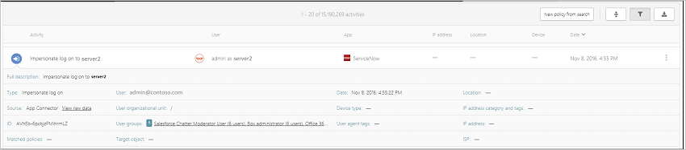

*適用於：Microsoft Cloud App Security*

# 活動
Microsoft Cloud App Security 可讓您從連接的應用程式看見所有活動。 Cloud App Security 連接到使用 App 連線程式的應用程式後，Cloud App Security 會掃描發生的所有活動 (每個應用程式的追溯掃描時段都不相同)，再以新的活動不斷更新。 

> [!NOTE] 
> 如需 Cloud App Security 所監視的 Office 365 活動完整清單，請參閱[搜尋 Office 365 安全與規範中心的稽核記錄](https://support.office.com/article/Search-the-audit-log-in-the-Office-365-Security-Compliance-Center-0d4d0f35-390b-4518-800e-0c7ec95e946c?ui=en-US&rs=en-US&ad=US#ID0EABAAA=Audited_activities)

您可以篩選 [活動記錄]，進而找到特定活動。 您可以根據活動建立原則，然後定義想要收到的警示項目並採取動作。 您也可以搜尋對特定檔案執行的活動。 我們取得之每項活動的活動與資訊類型，都是取決於應用程式以及應用程式可提供的資料種類。 

例如，您可以使用 [活動記錄] 尋找組織中使用過期作業系統或瀏覽器的使用者，方法如下：當您在 [活動記錄] 頁面上將應用程式連接到 Cloud App Security 之後，請使用進階篩選，並選取 [User agent tag]\(使用者代理程式標記)。 然後選取 [過期的瀏覽器] 或 [過期的作業系統]。

 
 
基本篩選條件提供您絕佳的工具以開始篩選活動。

 

若要向下鑽研更明確的活動，您可以按一下 [進階] 展開基本篩選條件。

 

> [!NOTE] 
> 舊版標記會新增至任何使用舊版「使用者」篩選條件的活動原則。 此篩選條件將繼續如往常般運作。 如果您想要移除舊版的標記，您可以移除該篩選條件，然後使用新的 [使用者名稱] 篩選條件再次新增篩選條件。
 
## 活動下拉式清單

### 使用 [活動] 下拉式清單

您可以檢視各項活動的詳細資訊，方法是在活動記錄中按一下活動本身。 如此即開啟 [活動] 下拉式清單，其中可為每個活動提供下列額外動作和深入解析：
    - 相符原則：按一下 [相符原則] 連結以查看此活動符合的原則清單。
    - 檢視原始資料︰按一下 [檢視原始資料] 以查看從應用程式收到的實際資料。
    - 使用者：按一下使用者檢視活動執行使用者的使用者頁面。 
    - 裝置類型：按一下裝置類型檢視未經處理的使用者代理程式資料。 
    - 位置：按一下位置用 Bing 地圖服務檢視位置。
    - IP 位址類別與標記：按一下 IP 標記以檢視在此活動中找到的 IP 標記清單。 您接著可以依據符合此標記的所有活動進行篩選。    

 隱藏式活動選單中的欄位提供您可能想要從該隱藏式選單中直接執行的額外活動和向下切入的內容連結。 例如，如果您將游標移到 IP 位址類別旁邊，您可以使用 [新增至篩選] 圖示 ，立即將 IP 位址新增至目前頁面的篩選中。 您也可以使用快顯的 [設定] 齒輪圖示 ，直接抵達修改其中一個欄位設定所需的設定頁面，例如**使用者群組**。

 您也可以使用索引標籤頂端的圖示以執行下列動作：
 - 檢視相同類型的活動
 - 檢視同一個使用者的所有活動
 - 檢視來自同一個 IP 位址的活動
 - 檢視來自相同地理位置的活動
 - 檢視來自相同時段 (48 小時) 的活動
 
  
  
如需可用的治理動作清單，請參閱[活動治理動作](governance-actions.md#activity-governance-actions)。

#### 使用者深入解析

調查體驗包括目前使用者的預設深入解析。 您只要按一下就可以取得使用者的完整概觀，包括連線來源位置、所涉及的未解決警示數目，以及其中繼資料資訊。

檢視使用者深入解析：

1. 在 [活動記錄] 中按一下活動本身。

2. 然後按一下 [使用者] 索引標籤。    這會開啟 [活動] 下拉式清單。[使用者] 索引標籤會提供下列的使用者深入解析：
    - **未解決的警示**：與使用者有關的未解決警示數目。
    - **檔案違規**：使用者所擁有檔案的檔案違規數目。
    - **活動**：使用者在過去 30 天執行的活動數目。
    - **國家/地區**：使用者在過去 30 天從中連線的國家/地區數目。
    - **ISP**：使用者在過去 30 天從中連線的 ISP 數目。
    - **IP 位址**：使用者在過去 30 天從中連線的 IP 位址數目。

#### IP 位址深入解析

因為 IP 位址資訊對幾乎所有調查都非常重要，所以您可以在 [活動] 下拉式清單中檢視 IP 位址的詳細資訊。 在特定活動中，您可以按一下 IP 位址索引標籤，檢視 IP 位址的相關彙總資料，包括特定 IP 位址的未解決警示數目、最近活動的趨勢圖形，以及位置地圖。 如此將有助於深入調查，例如當調查不可能的旅遊警示時，您可以輕鬆地了解使用的 IP 位址位置，以及它是否涉及可疑活動。 您也可以直接在 [IP 位址] 下拉式清單中執行動作，讓您將某個 IP 位址標記為有風險、VPN 或公司，以便日後進行調查和建立原則。

檢視 IP 位址深入解析：

1. 在 [活動記錄] 中按一下活動本身。

2. 然後按一下 [IP 位址] 索引標籤。    這會開啟隱藏式 [活動] 選單的 [IP 位址] 索引標籤，其中提供 IP 位址的下列深入解析：
    - **未解決的警示**：與 IP 位址有關的未解決警示數目。
    - **活動**：過去 30 天依 IP 位址執行的活動數目。
    - **IP 位置**：過去 30 天 IP 位址從當中連線的地理位置。
    - **活動**：過去 30 天從此 IP 位址執行的活動數目。
    - **管理員活動**：過去 30 天從此 IP 位址執行的管理活動數目。
    - 您可以執行下列 IP 位址動作：
        - 標記為有風險 
        - 標記為 VPN IP 位址
        - 標記為有風險的 IP，並新增至封鎖的群組

## 匯出活動 

您可以將所有使用者活動都匯出至 CSV 檔案。 

在 [活動記錄檔] 的右上角，按一下 [匯出] 按鈕 。

[!INCLUDE [Handle personal data](../includes/gdpr-intro-sentence.md)]

## 另請參閱  
[可保護雲端環境的日常活動](daily-activities-to-protect-your-cloud-environment.md)   

[Premier 客戶也可以直接從 Premier 支援入口網站選擇 Cloud App Security。](https://premier.microsoft.com/)  
  
  