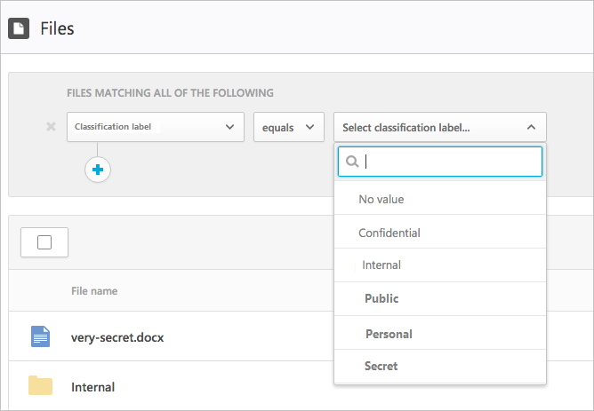
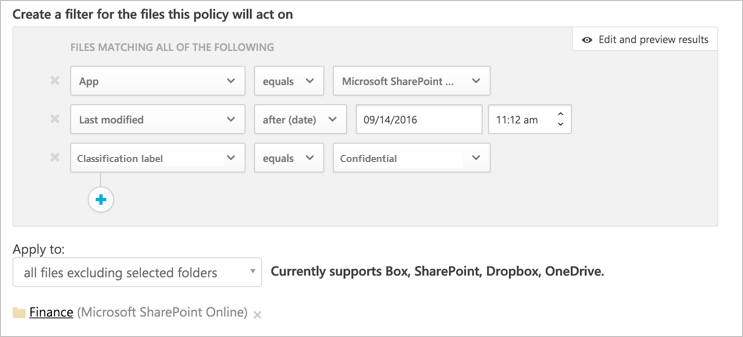

# Azure 資訊保護整合

Cloud App Security 可讓您調查檔案，並依據 Azure Information Protection 分類標籤設定原則，提升您監視及控制雲端上敏感性資料的能力。 整合 Azure Information Protection 與 Cloud App Security 就像選取一個單一核取方塊一樣簡單。 

將 Azure Information Protection 整合到 Cloud App Security，即可利用這兩個服務的完整功能，以及保護雲端中的檔案，包括︰
- 在集中位置檢視所有分類檔案的能力
- 根據分類層級執行調查以及量化雲端應用程式上敏感性資料暴露的能力
- 建立原則以確認正確處理分類檔案的能力

> [!NOTE] 
> 若要能夠執行此功能，除了需要 Cloud App Security 授權之外，也需要 Azure Information Protection Premium P1 或 P2 的授權。 當這項兩種授權準備就緒之後，Cloud App Security 便會從 Azure Information Protection 服務同步組織標籤。

## 運作方式
您可能熟悉 [Azure Information Protection](https://docs.microsoft.com/information-protection/) 中的檔案分類標籤。 您可以在 Cloud App Security 中查看 Azure Information Protection 分類標記。 整合 Cloud App Security 與 Azure Information Protection 之後，Cloud App Security 就會如下所述掃描檔案：
1. Cloud App Security 會擷取您租用戶所使用的所有分類標籤清單。 每隔一小時會執行一次，使清單維持最新狀態。
2. Cloud App Security 接著會掃描檔案是否有分類標籤，如下所示︰a. 如果您已啟用自動掃描 (請參閱下面)，則會將所有新的或修改過的檔案新增至掃描佇列。
    b. 如果您設定檔案原則 (請參閱下面) 以搜尋分類標籤，會將這些檔案新增至分類標籤的掃描佇列。
3. 如上所述，這些掃描是針對 Cloud App Security 執行初始掃描時所發現的分類標籤，以查看租用戶所使用的分類標籤。 外部標籤 (租用戶外部人員所設定的分類標籤) 會新增至分類標籤清單。 若不想掃描，請選取 [Only scan files for Azure Information Protection classification labels from this tenant] (只掃描此租用戶的 Azure 資訊保護分類標籤) 核取方塊 (如下所示)。
4. 在 Cloud App Security 上啟用 Azure Information Protection 之後，也會掃描所有已新增至 Office 365 的新檔案是否有分類標籤。

## 如何整合 Azure Information Protection 與 Cloud App Security
  
### 啟用 Azure Information Protection

整合 Azure Information Protection 與 Cloud App Security 時，您只需要：啟用自動掃描以在 Office 365 檔案搜尋 Azure Information Protection 分類標籤，而不需要建立一個原則。 啟用這項功能之後，如果您有雲端環境中標上 Azure Information Protection 分類標籤的檔案，則會在 Cloud App Security 中看到它們。

讓 Cloud App Security 掃描已啟用分類標籤內容檢查的檔案：

1. 在 Cloud App Security 的 [設定] 齒輪下，選取 [一般設定] 頁面。
2. 在 Azure 資訊保護下，選取 「Automatically scan files for Azure Information Protection classification labels」 (自動掃描檔案尋找 Azure 資訊保護分類標籤)。 

啟用 Azure Information Protection 之後，就可以在 Cloud App Security 中查看具有分類標籤的檔案以及根據標籤進行篩選。

 

> [!NOTE] 
> 自動掃描要再次修改後，才會掃描現有的檔案。 若要掃描現有檔案是否有 Azure 資訊保護分類標籤，您至少要有一項**內容檢查檔案原則**。 如果完全沒有的話，請建立新的**檔案原則**、刪除所有預設篩選，並選取 [內容檢查] 選項。 接著在 [內容檢查] 下，按一下 [Include files that match a preset expression (包含符合預設運算式的檔案)] 並選取任何預先定義的值，然後儲存原則。 如此一來，內容檢查就能自動偵測 Azure 資訊保護分類標籤。

### 設定內部和外部標記
Cloud App Security 預設會掃描您組織所定義的分類標籤，以及其他組織所定義的外部分類標籤。 

若要忽略在組織外部設定的分類標籤，請在 Cloud App Security 入口網站，從 [一般設定] 的 [Auzre 安全性設定] 下，選取 [Ignore Azure Information Protection classification labels from other tenants] (忽略其他租用戶的 Azure Information Protection 分類標籤)。
 

### 控制檔案暴露
- 如果這是您使用 Azure Information Protection 分類標籤標上標籤的文件︰

- 篩選分類標籤，即可在 Cloud App Security 的 [檔案] 頁面中查看此檔案︰

- 您可以取得檔案抽屜中這些檔案和其分類標籤的詳細資訊。

- 在 [檔案] 頁面中，按一下相關檔案以查看其中是否有任何分類標籤：

- 您可以按一下分類標籤檢視更多資訊，或查看完整分類標籤清單：
 

- 接著，您可以在 Cloud App Security 建立檔案原則，以控制不當共用的檔案，以及找到已標示標籤但近期曾修改過的檔案。
- 此外，您可對與分類檔案相關的活動觸發警示。

> ![Note] 當停用檔案上的 Azure Identity Protection 標籤時，停用的標籤在 Cloud App Security 中會顯示為「已停用」。 已刪除的標籤則不會顯示。
> **原則 #1 - 在 Box 上對外共用機密資料：**

1.    建立檔案原則。
2.    設定原則的名稱、嚴重性及類別。
3.    新增下列篩選尋找在 Box 上對外共用的所有機密資料：

 

**原則 #2 - 受限制的資料最近曾在 SharePoint 的 Finance 資料夾以外之處修改過：**

1.    建立檔案原則。
2.    設定原則的名稱、嚴重性及類別。
3.    新增下列篩選尋找所有最近曾經修改過之受限制的資料，並在資料夾選擇選項中新增排除 Finance 資料夾： 
 
 

您也可以為這些原則選擇設定警示、使用者通知或立即採取行動。
深入了解[管理動作](governance-actions.md)。

深入了解 [Azure 資訊保護](https://docs.microsoft.com/en-us/information-protection/understand-explore/what-is-information-protection)及查看 Azure 資訊保護[快速入門教學課程](https://docs.microsoft.com/en-us/information-protection/get-started/infoprotect-quick-start-tutorial)。

 
## 另請參閱  
[使用原則來控制雲端應用程式](control-cloud-apps-with-policies.md)   
[如需技術支援，請前往 Cloud App Security 的輔助支援頁面。](http://support.microsoft.com/oas/default.aspx?prid=16031)   
[Premier 客戶也可以直接從 Premier 支援入口網站選擇 Cloud App Security。](https://premier.microsoft.com/)  
  
