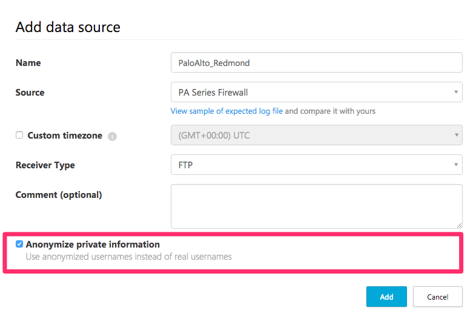

# Cloud Discovery 資料匿名

Cloud Discovery 資料匿名可讓您保護使用者隱私權。 將資料記錄檔上傳至 Cloud App Security 入口網站之後，會妥善處理記錄檔，並將所有使用者名稱資訊取代為加密使用者名稱。 如此一來，所有雲端活動都會保持匿名。 必要時，針對特定安全性調查 (例如，由於安全性缺口或可疑使用者活動)，系統管理員可以解析真實使用者名稱。 如果系統管理員有理由懷疑特定使用者，則也可以查閱已知使用者名稱的加密使用者名稱，然後使用加密使用者名稱來開始進行調查。 每個使用者名稱轉換都是在入口網站的**治理記錄**中進行稽核。

重點︰
-   不會儲存或顯示任何私人資訊。 僅限加密資訊。
-   搭配使用 AES-128 與每個租用戶的專用金鑰，來加密私人資料。
-   解析使用者名稱是透過解密指定的加密使用者名稱，根據使用者，以臨機操作方式執行。

資料匿名運作方式：

1.  有三種方法可以套用資料匿名： 
    
    - 您可以設定特定記錄檔中要匿名的資料，方法是[建立新的快照報告](create-snapshot-cloud-discovery-reports.md)，然後選取 [匿名私人資訊]。
 

    - 您可以設定將要匿名的資料[自動上傳新的資料來源](configure-automatic-log-upload-for-continuous-reports.md)，方法是在新增資料來源時選取 「Anonymize private information」 (匿名私人資訊)。  
 

    - 您可以在 Cloud App Security 中設定預設值來匿名所有資料，而這些資料來自已上傳記錄檔中的快照報告以及來自記錄收集器中的連續報告，如下所示︰
     
        1. 在 [設定] 齒輪下，選取 [Cloud Discovery 設定]。
     
        2. 在 「Anonymization」 (匿名) 索引標籤中，若要預設匿名使用者名稱，請選取 「Anonymize private information by default in new reports and data sources」 (預設匿名新報告和資料來源中的私人資訊)。

        3. 在 [加密金鑰] 下，選取您要 [使用針對入口網站產生的專用金鑰] 或 [使用自訂金鑰]。 如果您選擇 [使用自訂金鑰]，請輸入 16 位元 UTF8 加密金鑰。
        4. 按一下 **[儲存]**。
  
  

2.  選取匿名時，Cloud App Security 會剖析流量記錄檔，並擷取特定資料屬性。
3.  Cloud App Security 會以加密的使用者名稱來取代使用者名稱。
4.  它接著會分析雲端使用量資料，並根據匿名資料來產生 Cloud Discovery 報告。
 
 

5.  針對特定調查 (例如，調查異常使用量警示)，您可以解析入口網站中的特定使用者名稱，並提供業務上的正當理由。 這個頁面也可用來查閱已知使用者名稱的加密使用者名稱。 

    1. 在 [設定] 齒輪下，選取 [Cloud Discovery 設定]。
    2. 在 「Anonymization」 (匿名) 索引標籤的 「Anonymize and resolve usernames」 (匿名和解析使用者名稱) 下，輸入您為何執行解析的理由。
    3. 在 「Enter username to resolve」 (輸入要解析的使用者名稱) 下，選取 「From anonymized」(匿名來源)，然後輸入匿名使用者名稱，或選取 「To anonymized」 (匿名目標)，然後輸入要解析的原始使用者名稱。 按一下 [解析]。 

6.  這個動作是在入口網站的**治理記錄**中進行稽核。 

  
      
## 另請參閱  
[使用原則來控制雲端應用程式](control-cloud-apps-with-policies.md)   
[如需技術支援，請前往 Cloud App Security 的輔助支援頁面](http://support.microsoft.com/oas/default.aspx?prid=16031)  \(英文\)。  
[Premier 客戶也可以直接從 Premier 支援入口網站選擇 Cloud App Security。](https://premier.microsoft.com/)  
    
      
  
