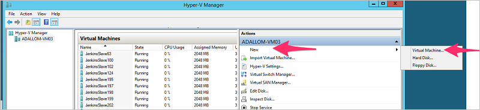

# <a name="configure-automatic-log-upload-for-continuous-reports-on-a-virtual-appliance"></a>在虛擬設備上設定自動記錄檔上傳以進行連續報告

> [!WARNING] 
> 此功能即將淘汰。

## <a name="technical-requirements"></a>技術需求
- Hypervisor：HyperV 或 VMware
- 磁碟空間：250 GB
- CPU：2
- RAM：4 GB 
- 防火牆設定： 
    - 允許記錄收集器接收輸入的 FTP 和 Syslog 流量
    - 允許記錄收集器起始輸出流量至連接埠 443 上的入口網站 (例如 contoso.cloudappsecurity.com)

  
## <a name="log-collector-performance"></a>記錄收集器效能
記錄收集器可以處理的記錄檔容量，每小時最多 50 GB。
記錄收集程序的主要瓶頸是︰
- 網路頻寬：您的網路頻寬決定記錄檔的上傳速度。
- IT 配置的虛擬機器 I/O 效能：決定記錄檔寫入記錄收集器磁碟的速度。
記錄收集器有內建的安全機制，會監視記錄檔到達的速率，並與上傳速率相比較。 如果網路擁塞，記錄收集器就會開始卸除記錄檔。 如果您的安裝程式通常每小時超過 50 GB，建議您將流量分割至多個記錄收集器。

## <a name="set-up-and-configuration"></a>安裝與設定  
  
### <a name="step-1--web-portal-configuration-define-data-sources-and-link-them-to-a-log-collector"></a>步驟 1 – Web 入口網站設定：定義資料來源並將它們連結到記錄收集器  
  
1.  請移至自動上傳設定頁面上︰  
    在 Cloud App Security 入口網站中，依序按一下設定圖示 ，以及 [記錄收集器]。  
  
3.  為每個要上傳記錄檔的防火牆或 Proxy，建立相符的資料來源︰  
  
    a.  按一下 [加入資料來源]。  
  
    b.  **命名** Proxy 或防火牆。  
  
    c.  從 [來源] 清單中選取設備。 如果您選取 [自訂記錄檔格式] 來處理未特別列出的網路設備，請參閱[使用自訂記錄檔剖析器](custom-log-parser.md)以了解組態指示。
  
    d.  比較您的記錄檔和預期的記錄檔格式範例。 如果您的記錄檔格式不符合此範例，您應該將資料來源加入為 [其他]。  
  
    e.  將 [接收器類型] 設為 [FTP] 或 [Syslog]。 若為 **Syslog** 請選擇 [UDP] 或 [TCP]。  
  
    f.  為記錄檔可用來偵測網路流量的每個防火牆和 Proxy 重複這個程序。  
  
4.  移至上方的 [記錄收集器] 索引標籤。  
  
    a.  按一下 [加入記錄收集器]。  
  
    b.  為記錄收集器**命名**。  
  
    c.  選取所有您想要連接到收集器的 [資料來源]，然後按一下 [更新] 以儲存設定並產生存取權杖。  

  
  > [!NOTE] 
  > - 單一記錄收集器可以處理多個資料來源。
  > - 請複製螢幕的內容，因為當您進行記錄收集器與 Cloud App Security 的通訊設定時會需要這些資訊。 如果您已選取 Syslog，則這些資訊會包含 Syslog 接聽程式會在哪個連接埠接聽的資訊。
4.  按一下 Hyper-V 或 VMWare，以**下載**新的記錄收集器虛擬機器，並使用您在入口網站接收到的密碼解壓縮檔案。  
  
### <a name="step-2--on-premises-deployment-of-the-virtual-machine-and-network-configuration"></a>步驟 2 – 虛擬機器的內部部署和網路設定   

> [!NOTE] 
> 下列步驟描述 Hyper-V 中的部署。 VM Hypervisor 的部署步驟有些不同。  

1.  開啟 Hyper-V 管理員。  
  
2.  依序選取 [新增] 和 [虛擬機器]，然後按一下 [下一步]。  
   
  
3.  為新的虛擬機器**命名**，例如 CloudAppSecurityLogCollector01，然後按一下 [下一步]。  
  
4.  選取 [Generation 1 (第 1 代)]，並按一下 [下一步]。  
  
5.  將 [啟動記憶體] 變更至 [4096 MB]。  
        
6. 檢查此虛擬機器的 [Use Dynamic Memory (使用動態記憶體)]，然後按一下 [下一步]。  
  
7.  如果有此選項，請選擇網路 [連線]，並按一下 [下一步]。  
  
8.  選擇 [使用現有的虛擬硬碟]並選取包含在下載之 ZIP 檔案中的 .**vhd** 檔案。  
  
9.  按 [下一步]  ，然後按一下 [完成] 。  
    電腦即新增至您的 Hyper-V 環境。  
  
9. 按一下 [虛擬機器] 資料表中的機器，然後按一下 [啟動]。   
  
10. 連接至記錄收集器的虛擬機器，查看其是否已指派 DHCP 位址：按一下虛擬機器，然後選取 [連線]。 您應該會看到登入提示。 如果您有看到 IP 位址，即可使用終端機/SSH 工具連接至虛擬機器。  如果未顯示 IP 位址，請使用 Hyper-V/VMWare 連線工具與您在建立上述記錄收集器時所複製的認證，進行登入。 您可以執行以下命令以使用網路設定公用程式來變更密碼及設定虛擬機器：
```
sudo network_config
```
> [!NOTE]
> 虛擬機器已預先設定為從 DHCP 伺服器取得 IP 位址。 如果您需要設定靜態 IP 位址、預設閘道、主機名稱、DNS 伺服器和 NTPS，您可以使用 **network_config** 公用程式，或以手動方式執行變更。


此時，您的記錄收集器應已連接網路，並能夠連線至 Cloud App Security 入口網站。  

### <a name="step-3--on-premises-configuration-of-the-log-collection"></a>步驟 3 – 記錄集合的內部部署設定 
當第一次登入記錄收集器並從入口網站匯入記錄收集器的設定時，步驟如下： 

1.  使用入口網站提供給您的互動式管理認證，透過 SSH 登入記錄收集器。 (如果這是您第一次登入主控台，您必須變更密碼，並在變更密碼之後，再次登入。 如果您使用終端機工作階段，可能需要重新啟動終端機工作階段。 )
2.  使用您在建立記錄收集器時提供給您的存取權杖，執行收集器設定公用程式。```sudo collector_config <access token> ```
3. 輸入您的主控台網域，例如：```contoso.portal.cloudappsecurity.com```。您可以在登入 Cloud App Security 入口網站之後於 URL 中看到這項資訊。 

4. 輸入您要設定的記錄收集器名稱，例如：**CloudAppSecurityLogCollector01**或上圖中的 **NewYork**。

5.  從入口網站匯入記錄收集器的組態，如下所示︰  
  
      a.  使用入口網站提供給您的互動式管理認證，透過 SSH 登入記錄收集器。  
  
      b.  使用 ```sudo collector_config \<access token>``` 命令中提供給您的存取權杖執行收集器設定公用程式。  
     
      c.  輸入您的主控台網域，例如︰``` contoso.portal.cloudappsecurity.com ```
  
      d. 輸入您要設定的記錄收集器名稱，例如︰``` CloudAppSecurityLogCollector01  ```

### <a name="step-4---on-premises-configuration-of-your-network-appliances"></a>步驟 4 - 網路設備的內部部署設定

設定網路防火牆和 Proxy 定期將記錄匯出到對話方塊指示的專用 FTP 目錄 Syslog 連接埠，例如︰  
  
     `London Zscaler - Destination path: 614`  
  
     BlueCoat_HQ - Destination path: \<<machine_name>>\BlueCoat_HQ\  
  
### <a name="step-5---verify-the-successful-deployment-in-the-cloud-app-security-portal"></a>步驟 5 - 確認已在 Cloud App Security 入口網站中部署成功

在 [記錄收集器] 資料表中檢查收集器狀態，並確定狀態為 [已連線]。 如果是 [已建立]，記錄收集器連線和剖析可能尚未完成。


移至 [治理記錄] 並確認記錄檔會定期被上傳到入口網站。  
  
如果您在部署期間遇到問題，請參閱[為雲端探索進行疑難排解](troubleshooting-cloud-discovery.md)。

### <a name="optional---create-custom-continuous-reports"></a>選擇性 - 建立自訂連續報告

在您確認要將記錄檔上傳到 Cloud App Security 並產生報告之後，您可以建立自訂報告。 您現在可以根據 Azure Active Directory 使用者群組建立自訂探索報告。 例如，如果您想要查看行銷部門的雲端使用情況，您可以使用 [匯入使用者群組] 功能匯入行銷群組，然後為此群組建立自訂報告。 您也可以自訂以 IP 位址標籤或 IP 位址範圍為基礎的報告。

1. 在 Cloud App Security 入口網站中，選取設定齒輪下的 [Cloud Discovery 設定]，然後選取 [管理連續報告]。 
2. 按一下 [建立報告] 按鈕並填入欄位。
3. 在 [篩選] 下，您可以依資料來源、依[匯入的使用者群組](user-groups.md)或依 [IP 位址標籤和範圍](ip-tags.md)來篩選資料。 


## <a name="see-also"></a>另請參閱  
[使用 Cloud Discovery 資料](working-with-cloud-discovery-data.md)   
[如需技術支援，請前往 Cloud App Security 的輔助支援頁面。](http://support.microsoft.com/oas/default.aspx?prid=16031)   
[Premier 客戶也可以直接從 Premier 支援入口網站選擇 Cloud App Security。](https://premier.microsoft.com/)  
    
      
  