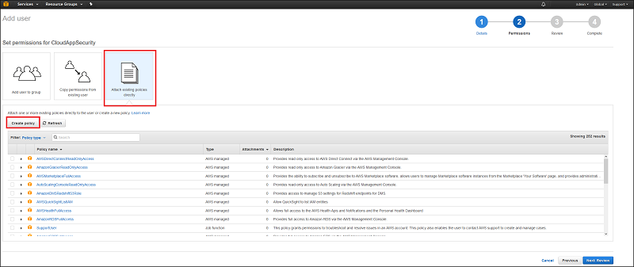

# <a name="connect-aws-to-microsoft-cloud-app-security"></a>將 AWS 連接至 Microsoft Cloud App Security
本節提供的指示說明如何使用連接器 API，將 Cloud App Security 連接至您現有的 Amazon Web Services 帳戶。  
  
## <a name="how-to-connect-amazon-web-services-to-cloud-app-security"></a>如何將 Amazon Web Services 連接至 Cloud App Security  
  
1.  在 Amazon Web Services 主控台中，按一下 [身分識別與存取權管理]。  
  
       
  
2.  按一下 [使用者] 索引標籤。  
  
       
  
3.  按一下 [建立新的使用者]。  
  
       
  
4.  為 Cloud App Security 建立新的使用者，並確定勾選 [Generate an access key for each user] (為每個使用者產生存取金鑰) 核取方塊。  
  
5.  按一下 [Download Credentials (下載認證)] 。  
  
       
  
6.  在 [使用權限] 索引標籤上，按一下 [Attach Policy] (附加原則)。  
  
       
  
7.  [檢閱原則] 畫面隨即開啟。
 
       
  

8. 在 [原則名稱] 下方，輸入 "AdallomTrustPolicy"。 
10. 在 [原則文件] 下方，複製並貼上下列項目︰  
  
    ```     
    {  
      "Version" : "2012-10-17",  
      "Statement" : [{  
          "Action" : [  
            "cloudtrail:DescribeTrails",  
  
           "cloudtrail:LookupEvents",  
            "cloudtrail:GetTrailStatus",  
            "cloudwatch:Describe*",  
            "cloudwatch:Get*",  
            "cloudwatch:List*",  
            "iam:List*",  
            "iam:Get*"  
          ],  
          "Effect" : "Allow",  
          "Resource" : "*"  
        }  
      ]  
     }  
  
    ```  
  
9. 在下載檔案 `credentials.csv` 中，找出新使用者的認證。 您稍後需要複製這些。  
  
10. 返回 AWS 主控台主頁面，在右上角的下拉式視窗中選擇您的主要區域，然後在主功能表中按一下 [CloudTrail]。  
  
       
  
    1.  如果未曾對此區域使用過 CloudTrail，請按一下 [開始使用] 按鈕，選取適當的 S3 陣列安裝它。  
  
         按一下畫面左上角的 [設定] 索引標籤。 按一下 [其他設定] 下的編輯圖示。  
  
           
  
    2.  當系統詢問您是否要 [Include global services (包含全域服務)] 時，請按一下 [是]，並按一下 [儲存]。 這只適用於您選擇的區域。  
  
           
  
    3.  請針對所有區域重複步驟 11，但任何其他地區請不要設定 [Include global services (包含全域服務)]。  
  
11. 在 Cloud App Security 入口網站中，依序按一下 [調查] 和 [獲批准的應用程式]。  
  
12. 在 AWS 列中，按一下 [App 連線程式狀態] 欄位中的 [連線]，或依序按一下 [連線到應用程式] 按鈕和 [AWS]。  
  
       
  
13. 在 Amazon Web Services 設定頁面中，將 CSV 檔案的**存取金鑰**和**秘密金鑰**貼入 [API] 頁面的欄位中，然後按一下 [更新存取金鑰]。  
  
14. 請按一下 [測試 API] 確定連線成功。  
  
     測試可能需要幾分鐘的時間。 完成後，您會收到成功或失敗的通知。 收到成功通知之後，按一下 [完成]。  
  
連接 AWS 之後，您會收到連線前 7 天的事件。
  
## <a name="see-also"></a>另請參閱  
[使用原則來控制雲端應用程式](control-cloud-apps-with-policies.md)   
[如需技術支援，請前往 Cloud App Security 的輔助支援頁面。](http://support.microsoft.com/oas/default.aspx?prid=16031)   
[Premier 客戶也可以直接從 Premier 支援入口網站選擇 Cloud App Security。](https://premier.microsoft.com/)  
  
  


<!--HONumber=Oct16_HO4-->


