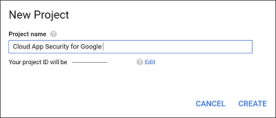
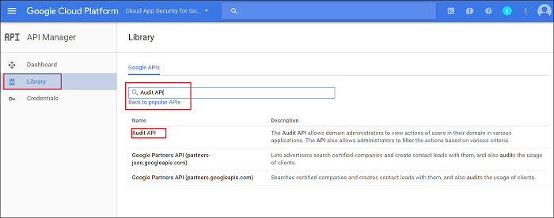
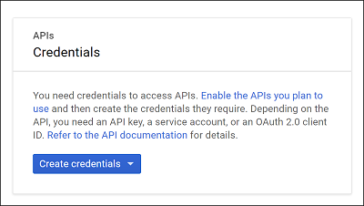
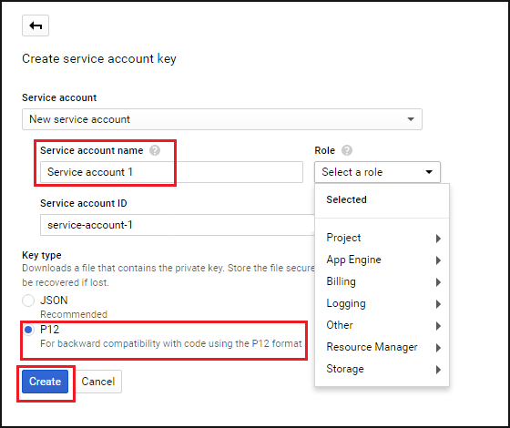
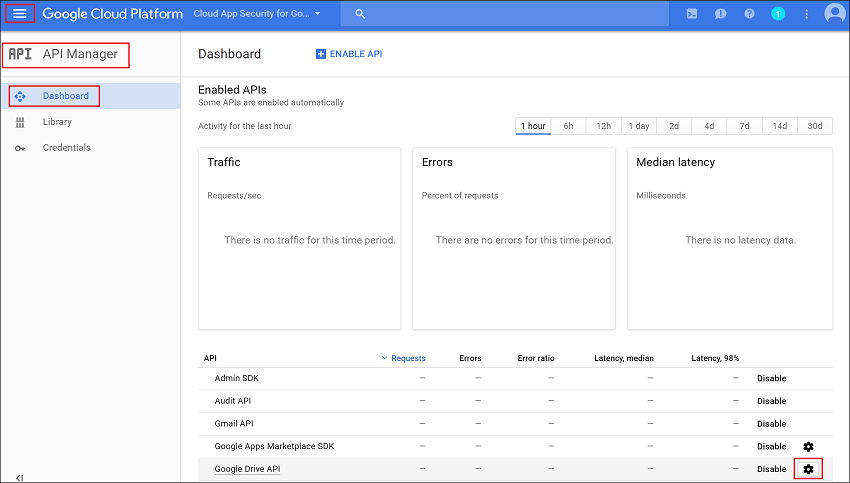
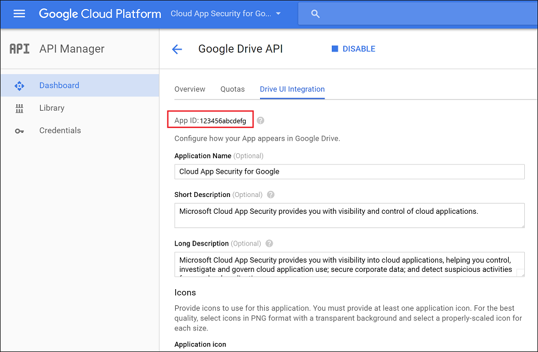

# 將 G Suite 連接至 Microsoft Cloud App Security
本節提供的指示說明如何使用連接器 API，將 Cloud App Security 連接至您現有的 G Suite 帳戶。

  
  
## 設定 G Suite  
  
1.  以 G Suite 超級管理員身分登入 [https://cloud.google.com/console/project](https://cloud.google.com/console/project)。  
  
2.  按一下 [建立專案] 開始新的專案。  
  
       
  
3.  在 [新增專案] 畫面中命名您的專案，如下所示︰ 
    **Cloud App Security for Google** 然後按一下 [建立]****。  
             
  
4.  專案建立後，在工具列上的 Google Cloud Platform 旁邊，選取專案，然後按一下 [API] 的 [Go to APIs overview]\(移至 API 概觀)。  
  
       
  
5.  停用 [API] 下列出的所有 API。  
      
6.  按一下 [程式庫] 啟用下列 API (如果 [Popular APIs]\(熱門 API) 清單未列出 API，請使用搜尋列)：  
  
       
  
    > [!NOTE]  
    >  暫時忽略**認證**警告。  
  
    -   管理 SDK  
  
    -   稽核 API  
  
    -   Google Drive API  
  
    -   Google Apps Marketplace SDK  
  
    -   Gmail API  
            
7.  您應該會有 5 個 [Enabled APIs (啟用的 API)]：  
  
       
  
8.  依序按一下 [認證] 和 [OAuth consent screen] (OAuth 同意畫面)  
  
    -   在 [Product name shown to users (向使用者顯示的產品名稱)] 中輸入 **Cloud App Security for Google**。  
  
    -   所有其他欄位都是選擇性的。  
  
    -   按一下 **[儲存]**。  
  
       
  
9. 在 [API Credentials] (API 認證) 畫面上，按一下 [建立認證] 旁的箭號。  
  
       

10. 選取 [服務帳戶金鑰]。

       
  
11. 在 [Create service account key] (建立服務帳戶金鑰) 下選擇 [New service account] (新增服務帳戶) 並鍵入任何名稱，例如**服務帳戶 1**；在 [角色] 下選擇 [專案] 及 [編輯器]，然後在 [金鑰類型] 下選擇 [P12] 並按一下 [建立]。  
  
       
  
12.  P12 憑證檔案會儲存到您的電腦。 快顯視窗會向您顯示**私密金鑰密碼**，請務必儲存以供後用。  
        
12. 在 [認證] 畫面中，按一下最右側的 [Manage service accounts] (管理服務帳戶)。  
         
  
13. 按一下所建服務帳戶右側的 3 個點，然後選取 [編輯]。  
  
       
  
14. 選取 [Enable G Suite Domain-wide Delegation] (啟用 G Suite 全網域委派) 核取方塊，然後按一下 [儲存]。  
  
       
  
15. 請複製指派給服務的**服務帳戶識別碼**，以供稍後使用。  
  
       
  
16. 按一下標題列中 Google Cloud Platform 旁的三條水平線，開啟 Google 功能表，然後依序選取 [API 管理員] 及 [儀表板]。  
    
17. 向下捲動至已啟用的 API 清單，並按一下 **Google Drive API** 旁的設定齒輪。   
         

18. 填寫下列內容：

    -   **應用程式名稱**：Cloud App Security for Google。  
  
    -   **簡短描述和完整描述**：(選用) Microsoft Cloud App Security 可讓您掌握雲端應用程式，協助您控制、調查和管理雲端應用程式使用，保護公司資料，以及偵測任何雲端應用程式的可疑活動。  
  
    -   Google 要求您至少上傳一個應用程式圖示。 請移至 [https://portal.cloudappsecurity.com/cas/static/files/MSLogos.zip](https://portal.cloudappsecurity.com/cas/static/files/MSLogos.zip) 下載包含 Cloud App Security 圖示的 ZIP 檔案。 然後，在**應用程式圖示**下拖放 128x128 和 32x32 影像。  
  
    -   在 [Drive Integration] (磁碟機整合) 下的 [開啟 URL:] 中鍵入：  
  
         https://portal.cloudappsecurity.com/#/services/11770?tab=files  
  
    -   按一下 [儲存變更]。  
  
           
  
19. 在 [Enabled APIs] (啟用的 API) 清單中，按一下 [Google Apps Marketplace SDK] 旁邊的設定齒輪。 
           
20. 選取 [設定] 索引標籤。  
  
    -   複製上方顯示的**專案編號 (應用程式識別碼)** 以供日後使用。  
  
    -   [應用程式名稱] 應顯示 **Cloud App Security for Google**。
  
         在 [應用程式描述] 欄位中填入「Microsoft Cloud App Security 可讓您掌握雲端應用程式，協助您控制、調查和管理雲端應用程式使用，保護公司資料，以及偵測任何雲端應用程式的可疑活動。」  
  
    -   取消核取 [Enable individual install] (啟用個別安裝) 核取方塊。  
  
    -   在**應用程式圖示**下設定 4 個必要影像。  
  
         影像位於︰[https://portal.cloudappsecurity.com/cas/static/files/MSLogos.zip](https://portal.cloudappsecurity.com/cas/static/files/MSLogos.zip)  
  
           
  
    -   填寫下列**支援 URL**：  
  
        -   **服務條款 URL**：http://go.microsoft.com/fwlink/?LinkID=733268  
  
        -   **隱私權原則 URL**：http://go.microsoft.com/fwlink/?LinkId=512132  
  
    -   在 [OAuth 2.0 scopes] (OAuth 2.0 領域) 下複製和貼上下列內容。 它們一次只能複製一個，並且每次複製都必須按下 Enter︰  
  
           https://www.googleapis.com/auth/admin.reports.audit.readonly  
  
           https://www.googleapis.com/auth/admin.reports.usage.readonly  
  
           https://www.googleapis.com/auth/drive  
  
           https://www.googleapis.com/auth/drive.appdata  
  
           https://www.googleapis.com/auth/drive.apps.readonly  
  
           https://www.googleapis.com/auth/drive.file  
  
           https://www.googleapis.com/auth/drive.metadata.readonly  
  
           https://www.googleapis.com/auth/drive.readonly  
  
           https://www.googleapis.com/auth/drive.scripts  
  
           https://www.googleapis.com/auth/admin.directory.user.readonly  
  
           https://www.googleapis.com/auth/admin.directory.user.security  
  
           https://www.googleapis.com/auth/admin.directory.user.alias  
  
           https://www.googleapis.com/auth/admin.directory.orgunit  
  
           https://www.googleapis.com/auth/admin.directory.notifications  
  
           https://www.googleapis.com/auth/admin.directory.group.member  
  
           https://www.googleapis.com/auth/admin.directory.group  
  
           https://www.googleapis.com/auth/admin.directory.device.mobile.action  
  
           https://www.googleapis.com/auth/admin.directory.device.mobile  
  
           https://www.googleapis.com/auth/admin.directory.user  
  
    -   按一下 [儲存變更]。  
  
18. 請移至 [admin.google.com](https://admin.google.com/)，然後選擇 [安全性]。 
         
 
19. 選擇 [API 參考]。  
         
      
20. 選取 [Enable API Access (啟用 API 存取)]，然後按一下 [儲存變更]。  
  
      

  
## 設定 Cloud App Security  
  
1.  在 Cloud App Security 入口網站中，依序按一下 [調查] 和 [連線應用程式]。  
  
2.  在 [連線應用程式] 頁面中，按一下加號並選取 [G Suite]。  
       
  
3.  在快顯視窗中填入下列內容：  
  
       
  
    1.  您在步驟 16 中複製的**服務帳戶電子郵件地址**。  
  
    2.  您在步驟 21 中複製的**專案編號 (應用程式識別碼)**。  
  
    3.  上傳您在步驟 12 中儲存的**憑證** P12。 您需要之前儲存的密碼才能執行這項操作。  
  
    4.  輸入 G Suite 系統管理員其中一個**系統管理員帳戶的電子郵件**。  
  
    5.  如果您有 G Suite Unlimited 帳戶，請核取這個核取方塊。 如需 Cloud App Security for G Suite Unlimited 可用功能的資訊，請參閱[為您的應用程式提供立即可見度、保護及治理動作](enable-instant-visibility-protection-and-governance-actions-for-your-apps.md)。  
  
    6.  按一下 [儲存設定]。  
  
    7.  [連入此連結] 連接到 G Suite。 這會開啟 G Suite，並要求您授與 Cloud App Security 存取權。  
         
    8.  按一下 [Test now] (立即測試) 確定連線成功。  
  
         測試可能需要幾分鐘的時間。  
  
         收到成功通知之後，按一下 [完成] 並關閉 G Suite 頁面。  
  
  
連接 G Suite 之後，您會收到連線前 60 天的事件。
  
連接 G Suite 之後，Cloud App Security 即會執行完整掃描。 根據您擁有的檔案與使用者數量而定，完整掃描可能需要一段時間才能完成。 為了確保近即時的掃描，系統會將已偵測到活動的檔案移到掃描佇列開頭，好比說，系統會立即掃描受到編輯、更新或共用的檔案，而不會等到定期掃描程序時才進行。 如果檔案本來就沒有修改 (例如只受到檢視、預覽、列印或匯出的檔案)，則不適用此情況。
  
  
## 另請參閱  
[使用原則來控制雲端應用程式](control-cloud-apps-with-policies.md)   
[如需技術支援，請前往 Cloud App Security 的輔助支援頁面。](http://support.microsoft.com/oas/default.aspx?prid=16031)   
[Premier 客戶也可以直接從 Premier 支援入口網站選擇 Cloud App Security。](https://premier.microsoft.com/)  
  
  