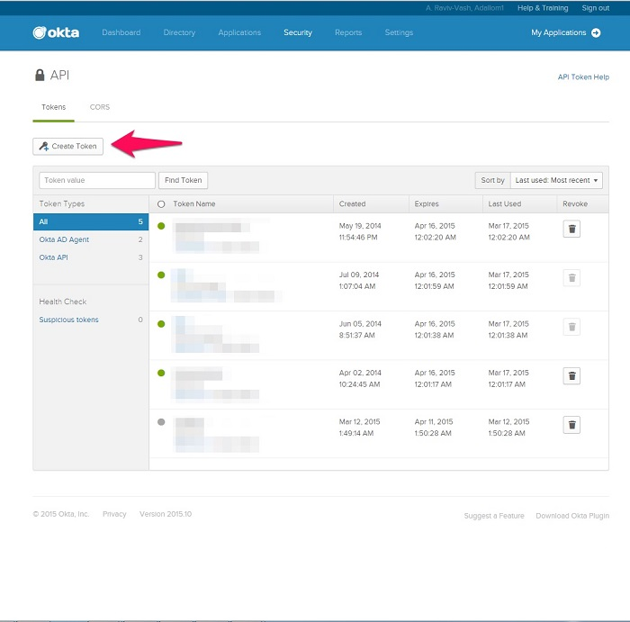

# 將 Okta 連接至 Microsoft Cloud App Security
本節提供的指示說明如何使用連接器 API，將 Cloud App Security 連接至您現有的 Okta 帳戶。  
  
## 如何將 Okta 連接至 Cloud App Security  
  
1.  建議您在 Okta 中為 Cloud App Security 建立系統管理服務帳戶。  
  
     確定您使用具有進階管理員權限的帳戶。  
  
     確定您的 Okta 帳戶已驗證。  
  
2.  在 Okta 主控台中，按一下 [系統管理]。  
  
    -   按一下 [安全性]，然後按一下 [API]。  
  
           
  
    -   按一下 [建立權杖]。  
  
           
  
    -   在 [建立權杖] 快顯視窗中，命名您的 Cloud App Security 權杖，然後按一下 [建立權杖]。  
  
           
  
    -   在 [Token created successfully]\(已成功建立權杖) 快顯視窗中，複製 [權杖值]。  
  
           
  
3.  在 Cloud App Security 主控台中，依序按一下 [調查] 和 [連線應用程式]。  
  
4.  在 [App 連線程式] 頁面中，依序按一下加號按鈕及 [Okta]。  
  
       
  
5.  在開啟的快顯視窗中，於 [網域] 欄位內輸入您的 Okta 網域，並將您的權杖貼入至 [權杖] 欄位。  
  
6.  按一下 [連線] 在 Cloud App Security 中建立 Okta 的權杖。  
  
7.  按一下 [測試 API] 確定連線成功。  
  
     測試可能需要幾分鐘的時間。 收到成功通知之後，按一下 [關閉]。  
  
連接 Okta 之後，您會收到連線前 60 天的事件。
  
## 另請參閱  
[使用原則來控制雲端應用程式](control-cloud-apps-with-policies.md)   

[Premier 客戶也可以直接從 Premier 支援入口網站選擇 Cloud App Security。](https://premier.microsoft.com/)  
  
  