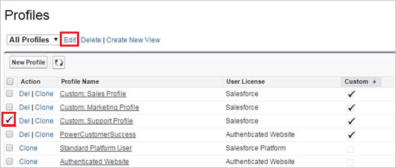
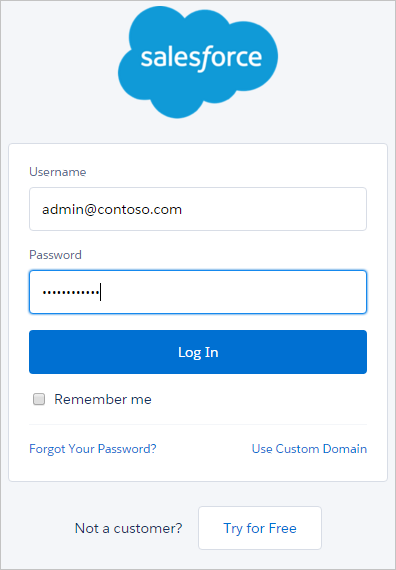

# 將 Salesforce 連接至 Microsoft Cloud App Security
本節提供的指示說明如何使用 App 連接程式 API，將 Cloud App Security 連接至您現有的 Salesforce 帳戶。  
  
## 如何將 Salesforce 連接至 Cloud App Security  
  
1.  建議使用 Cloud App Security 專屬的服務系統管理員帳戶。  
  
2.  驗證 REST API 已在 Salesforce 中啟用。  
  
     您的 Salesforce 帳戶必須是下列其中一個包含 REST API 支援的版本︰  
  
     **Performance**、**Enterprise**、**Unlimited** 或 **Developer**。  
  
     **Professional** 版本依預設沒有 REST API，但可以依需求新增。  
  
     請檢查您的版本有 REST API 可用且已啟用，如下所示︰  
  
    -   登入您的 Salesforce 帳戶，並移至 [設定] 頁面。  
  
    -   在 [管理使用者] 下，移至 [使用者設定檔] 頁面。  
  
           
  
    -   按一下 [新增] 建立新的設定檔。 
    - 選擇您剛才用來部署 Cloud App Security 的設定檔，然後按一下 [編輯]。 這是用於 Cloud App Security 服務帳戶的設定檔，可設定 App 連線程式。  
  
           
  
    -   請確定您已啟用下列核取方塊：   
        - **啟用 API**
        - **檢視所有資料** 
        - **管理 Salesforce CRM 內容**
        - **管理使用者**
        
        如果未選取這些核取方塊，您可能需要連絡 Salesforce 以將其新增至您的帳戶。  
             
3.  如果您的組織已啟用 **Salesforce CRM 內容**，請確定目前的系統管理帳戶也有啟用它。  
  
    1.  移至您的 Salesforce 設定頁面。  
  
           
  
    2.  從側邊功能表上，選取 [管理使用者]，然後按一下 [使用者]。  
  
           
  
    3.  將目前的系統管理使用者選取為專屬的 Cloud App Security 使用者。  
  
    4.  請確定已選取 [Salesforce CRM Content User]\(Salesforce CRM 內容使用者) 核取方塊。  
  
         如果未選取，請按一下 [編輯] 然後核取此核取方塊。  
  
           
  
    5.  按一下 **[儲存]**。  
  
4.  在 Cloud App Security 主控台中，依序按一下 [調查] 和 [連線應用程式]。  
  
5.  在 [App 連線程式] 頁面中，依序按一下加號按鈕及 [Salesforce]。  
  
       
  
6.  取決於您想要安裝哪一個執行個體，在 [Salesforce 設定] 頁面的 [API] 索引標籤中，按一下 [連入此連結]。  
  
7.  這會開啟 Salesforce 登入頁面。 輸入您的認證，允許 Cloud App Security 存取您小組的 Salesforce 應用程式。  
  
       
  
8.  Salesforce 會詢問您是否要允許 Cloud App Security 存取小組資訊和活動記錄檔，並允許其以任何小組成員的身分執行任何活動。 若要進行，請按一下 [允許]。  
  
9. 此時，您會收到關於部署成功或失敗的通知。 現在，Cloud App Security 已在 Salesforce.com 中獲得授權。  
  
10. 返回 Cloud App Security 主控台時，您應該會看到 Salesforce 已順利連接的訊息。  
  
11. 按一下 [測試 API] 確定連線成功。  
  
     測試可能需要幾分鐘的時間。 收到成功通知之後，按一下 [完成]。  
  
  
連接 Salesforce 之後，您將會收到下列「事件」：自連線起的觸發程序、連線前 60 天的登入事件與設定稽核線索、EventMonitoring 30 天前或 1 天前的事件 (根據您的 Salesforce EventMonitoring 授權而定)。 Cloud App Security API 會直接與 Salesforce 提供的 API 進行通訊。 因為 Salesforce 限制了可以接收的 API 呼叫數目，所以 Cloud App Security 會將此納入考量並遵守限制。 Salesforce API 傳送的每個回應都有 API 計數器欄位，包括可用總計數和剩餘計數。 Cloud App Security 以百分比計算此值，確保一律保留 10% 的可用 API 呼叫。 

> [!NOTE]
> Cloud App Security 節流只計算它自己和 Salesforce 的 API 呼叫，不計算任何其他應用程式和 Salesforce 進行的 API 呼叫。
> 因為限制而限制 API 呼叫會降低 Cloud App Security 內嵌資料的速率，但通常隔夜就會趕上進度。

Cloud App security 處理 Salesforce 事件的方式如下︰ 
  
- 每隔 15 分鐘登入事件
- 每隔 15 分鐘設定稽核記錄
- Salesforce 記錄會追蹤 UTC 時間上午 12:00 到下午 11:59 這 24 小時的 使用活動。 Salesforce 中的事件會即時產生記錄資料。 不過，Salesforce 會在事件發生之後的隔天，在非尖峰時間才產生記錄檔。 因此，事件發生之後至少有一天的時間，無法使用記錄檔資料。 如需 Salesforce 事件的詳細資訊，請參閱[使用事件監視](https://developer.salesforce.com/docs/atlas.en-us.api_rest.meta/api_rest/using_resources_event_log_files.htm) \(英文\)。

## 另請參閱  
[使用原則來控制雲端應用程式](control-cloud-apps-with-policies.md)   
[如需技術支援，請前往 Cloud App Security 的輔助支援頁面。](http://support.microsoft.com/oas/default.aspx?prid=16031)   
[Premier 客戶也可以直接從 Premier 支援入口網站選擇 Cloud App Security。](https://premier.microsoft.com/)  
  
  