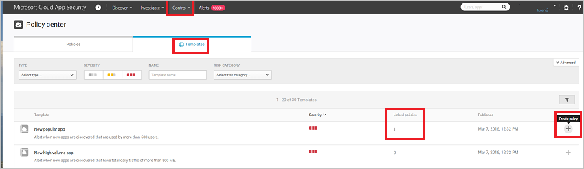

# 使用原則來控制雲端應用程式

原則可讓您定義使用者在雲端的行為舉止。 它們可讓您在雲端環境中，偵測到高風險的行為、違規或可疑的資料點和活動，必要時，也可整合修復工作流程，以完全降低風險。 有多種不同類型的原則，與您想要收集的雲端環境資訊以及您可能要採取的修復動作類型相互關聯。  
  
例如，如果您想要隔離資料違規威脅，您需要實施的原則，就會和您想要封鎖危險的雲端應用程式以讓您的組織無法使用它時所使用的原則類型不同。  
  
## 原則類型  
可以建立下列類型的原則︰  
  
|原則類型|用法|  
|-----------------|---------|  
|活動原則|活動原則可讓您利用應用程式提供者的 API，強制執行各種不同的自動化程序。 這些原則可讓您監視由不同使用者執行的特定活動，或是追蹤意外高比率的某種特定類型活動。|  
|異常偵測原則|異常偵測原則可讓您根據您在此處設定的風險因素，尋找雲端中的不尋常活動，在發生不同於組織基準或使用者一般活動的狀況時發出警示。|  
|Cloud Discovery 異常偵測原則|Cloud Discovery 異常偵測原則會查看您用於探索雲端應用程式的記錄檔，並搜尋不尋常的發生事件。 例如，某位使用者從未使用過 Dropbox，突然上傳 600 GB 到 Dropbox，或是在特定應用程式上的交易比起平日超出許多。|  
|應用程式探索原則|應用程式探索原則可讓您設定警示，在您的組織內偵測到新的應用程式時通知您。|  
|檔案原則|檔案原則可讓您掃描雲端應用程式是否有指定的檔案/檔案類型 (共用、與外部網域共用) 及資料 (專屬資訊、PII、信用卡資訊等)，並可套用治理動作至檔案 (治理動作依據特定雲端應用程式而異)。|  
  
## 識別風險  
Cloud App Security 可協助您降低雲端中的不同風險。 您可以設定任何原則和警示來與下列風險之一相關聯︰  
  
-   **存取控制︰**使用者從哪裡存取什麼？  
  
     持續監視行為，並偵測異常的活動，包括高風險的內部和外部攻擊，並且套用原則以針對任何應用程式或應用程式中的特定動作進行警示、封鎖或要求身分識別驗證。 依據使用者、裝置與地理位置，啟用內部部署與行動裝置存取控制原則，並搭配使用粗略式封鎖及細微檢視、編輯和封鎖功能。 偵測可疑的登入事件，包括多因素驗證失敗、已停用帳戶登入失敗，以及模擬事件。  
  
-   **相容性︰**是否違反您的相容性要求？  
  
     識別機密或管制資料並加以分類，包括共用每個檔案 (存放在檔案同步處理服務中) 的權限，以確保符合 PCI、SOX、HIPAA 等法規。  
  
-   **組態控制︰**正在對您的組態進行未經授權的變更嗎？  
  
     監視組態變更，包括遠端組態管理。  
  
-   **Cloud Discovery︰**您的組織是否正在使用未獲批准的新應用程式？ 您是否有正在使用您不了解之 Shadow IT 應用程式的問題？  
  
     根據法規和業界認證及最佳做法，評定每個雲端應用程式的整體風險，  
    可讓您監視每個雲端應用程式的使用者數目、  
    活動、傳輸量和一般使用時數。  
  
-   **DLP：**是否公開共用專屬檔案？ 您需要隔離檔案嗎？  
  
     內部部署的 DLP 整合可使用現有的內部部署 DLP 解決方案，提供整合和良性循環的修復。  
  
-   **特殊權限帳戶︰**需要監視管理員帳戶嗎？  
  
     特殊權限使用者和管理員的即時活動監視和報告。  
  
-   **共用控制︰**資料如何在您的雲端環境中共用？  
  
     檢查檔案的內容和雲端中的內容，並強制執行內部和外部共用原則。 監視共同作業，並強制執行共用原則，例如封鎖在組織外部共用檔案。  
  
-   **威脅偵測︰**是否有可疑活動正在威脅您的雲端環境？  
  
     針對任何原則違規或活動臨界值，透過簡訊或電子郵件接收即時通知。 藉由套用機器學習演算法，Cloud App Security 可讓您偵測可能表示使用者濫用資料的行為。  
  
## 如何控制風險  
請遵循此程序，使用原則來控制風險︰  
  
1.  從範本或查詢建立原則。  
  
2.  微調原則以達到預期的結果。  
  
3.  新增自動化動作，以便自動回應與補救風險。  
  
### 建立原則  
您可以使用 Cloud App Security 的原則範本做為所有原則的基礎，或從查詢建立原則。  
  
原則範本可協助您設定正確的必要篩選和組態，偵測您環境內感興趣的特定事件。 範本包含所有類型的原則，而且可以適用於各種服務。  
  
若要從 [原則範本] 建立原則，請執行下列動作︰  
  
1.  在主控台中，依序按一下 [控制] 和 [範本]。  
  
       
  
2.  按一下您想要使用的範本資料列最右側的 **+**。 隨即開啟 [建立原則] 頁面，其中包含預先定義的設定範本。  
  
3.  視需要為您的自訂原則修改範本。 在這個以範本為基礎的新原則中，每個屬性和欄位都可以根據您的需求而修改。  
> [!NOTE] 
>使用原則篩選器時，**Contains** 將只搜尋完整文字 – 以逗點、句點、空格或底線隔開。 例如，如果您搜尋 **malware** 或 **virus**，它會找到 virus_malware_file.exe，但不會找到 malwarevirusfile.exe。 如果您搜尋 **malware.exe**，則會找到檔名中有 malware 或 exe 的所有檔案；如果您搜尋 **"malware.exe"** (加上引號)，將只會找到包含確切 "malware.exe" 的檔案。 
     **Equals** 僅會搜尋完整字串；例如，如果您搜尋 **malware.exe**，它會找到 malware.exe，但不會找到 malware.exe.txt。  
4.  依據範本建立好新原則之後，原則範本資料表 (位於原則所建立的來源範本旁) 中的 [連結的原則] 資料行即會出現新原則的連結。  
     您可以從每個範本建立想要的原則數目，它們將全部連結到原始的範本，讓您能夠追蹤使用相同範本建立的所有原則。  
  
或者，您可以**在調查期間建立原則**。 如果您正在調查 [活動記錄]、[檔案] 或 [帳戶]，而且您向下切入以搜尋特定事物，您可以隨時根據您的調查結果建立新的原則。  
  
例如，如果您正在查看 [活動記錄]，看到其中一個管理員帳戶正在從非預期的地理位置登入，您可以篩選 [活動記錄] 的結果，顯示該管理員的所有活動記錄，然後建立報表，在下次偵測到該使用者的活動時通知您。  
  
若要根據調查結果建立原則，請執行下列作業︰  
  
1.  在主控台中，按一下 [調查]，然後按一下 [活動記錄]、[檔案] 或 [帳戶]。  
  
2.  使用頁面頂端的篩選器將搜尋結果限制在可疑的區域；例如，在 [活動記錄] 頁面中，按一下 [使用者]，然後選取其帳戶註冊不尋常活動的管理員。 然後，在 [活動] 下，選取 [複製資料夾] 和 [複製檔案]。  
  
       
  
3.  在主控台的右上角，按一下 [從搜尋新增原則]。  
  
4.  隨即開啟 [建立原則] 頁面，其中包含您在調查中使用的篩選器。  
  
5.  視需要為您的自訂原則修改範本。 在這個以調查為基礎的新原則中，每個屬性和欄位都可以根據您的需求而修改。  
   
> [!NOTE] 
> 使用原則篩選器時，**Contains** 將只搜尋完整文字 – 以逗點、句點、空格或底線隔開。 例如，如果您搜尋 **malware** 或 **virus**，它會找到 virus_malware_file.exe，但不會找到 malwarevirusfile.exe。  
     **Equals** 僅會搜尋完整字串；例如，如果您搜尋 **malware.exe**，它會找到 malware.exe，但不會找到 malware.exe.txt。  
  
 
 

 
 
  
> [!NOTE]  
>  如需設定原則欄位的詳細資訊，請參閱對應的原則文件︰  
>   
>  [使用者活動原則](user-activity-policies.md)  
>   
>  [資料保護原則](data-protection-policies.md)  
>   
>  [Cloud Discovery 原則](cloud-discovery-policies.md)  
  
### 原則衝突
建立多個原則之後，可能會出現原則重疊的狀況。 在此情況下，Cloud App Security 會以下列方式來處理原則：
* 如果兩個原則包含彼此重複的動作 (例如**設為私用**中包含**移除外部共用**)，Cloud App Security 會解決衝突，並強制執行較強的動作。
* 如果其中的動作完全無關 (例如**通知擁有者**和**設為私用**)， 則這兩個動作皆會執行。
* 如果動作彼此衝突，(例如**變更擁有者為使用者 A** 和**變更擁有者為使用者 B**)，則每個相符項目可能會產生不同的結果。 建議您變更原則以避免發生衝突，因為這些衝突可能會導致磁碟機出現有害且很難偵測得到的變更。 

## 另請參閱  
[可保護雲端環境的日常活動](daily-activities-to-protect-your-cloud-environment.md)   
[如需技術支援，請前往 Cloud App Security 的輔助支援頁面。](http://support.microsoft.com/oas/default.aspx?prid=16031)   
[Premier 客戶也可以直接從 Premier 支援入口網站選擇 Cloud App Security。](https://premier.microsoft.com/)  
  

<!--HONumber=Oct16_HO4-->

