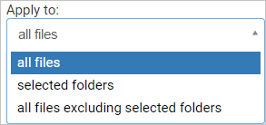

# 檔案

您可以篩選檔案記錄，進而找到特定檔案。 基本篩選條件提供您絕佳的工具以開始篩選檔案。

 

若要向下鑽研更明確的檔案，您可以按一下 [進階] 展開基本篩選條件。

 
 
###  檔案篩選器 
 
Cloud App Security 可以根據 20 個以上的中繼資料篩選條件 (例如：存取層級、檔案類型) 來監視任何檔案類型。 
 
Cloud App Security 的內建 DLP 引擎可從所有常見的檔案類型 (PDF、Office 檔案、RTF、HTML、程式碼檔案等) 擷取文字以執行內容檢查。

以下是可套用的檔案篩選器清單。 大部分的篩選器皆支援多個值與 NOT，以提供可在建立原則時使用的強大工具。  
> [!NOTE] 
> 使用原則篩選器時，**Contains** 將只搜尋完整文字 – 以逗點、句點、空格或底線隔開。 例如，如果您搜尋 **malware** 或 **virus**，它會找到 virus_malware_file.exe，但不會找到 malwarevirusfile.exe。 如果您搜尋 **malware.exe**，則會找到檔名中有 malware 或 exe 的所有檔案；如果您搜尋 **"malware.exe"** (加上引號)，將只會找到包含確切 "malware.exe" 的檔案。  **Equals** 僅會搜尋完整字串；例如，如果您搜尋 **malware.exe**，它會找到 malware.exe，但不會找到 malware.exe.txt。 

-   存取層級 – 共用存取層級；公開、外部、內部或私人。  如需外部檔案的詳細資訊，請參閱[一般設定、設定入口網站](getting-started-with-cloud-app-security.md)。內部檔案是指您在內部網域 (透過[一般設定](General-setup.md)來設定) 內使用的任何檔案。 外部檔案是指儲存在您所設定之內部網域以外的任何檔案。 共用檔案為具有私人以上之共用層級的檔案，包括內部共用 (在您的內部網域中共用的檔案)、外部共用 (在您的內部網域之外共用的檔案)、以連結公用 (可與任何人透過連結共用的檔案) 和公用 (可在網際網路上搜尋找到的檔案) 檔案。 

> [!NOTE]
>  Cloud App Security 會以下列方式處理由外部使用者共用到您的連線儲存體應用程式中的檔案：
> - **OneDrive：** OneDrive 會將內部使用者指派為任何外部使用者所放入您 OneDrive 中之檔案的擁有者。 如此一來，系統會將這些檔案視為組織所擁有，Cloud App Security 即可掃描這些檔案並套用原則，就像 OneDrive 中的任何其他檔案一樣。
> - **Google 雲端硬碟：**Google 雲端硬碟會將這些檔案視為外部使用者擁有，既然這些檔案和資料不屬於您的組織，基於法律限制，Cloud App Security 即不能存取這些檔案。
> - **Box：**由於 Box 會將外部擁有的檔案視為私人資訊，因此 Box 全域管理員無法查看檔案的內容。 基於這個理由，Cloud App Security 並不能存取這些檔案。 
> - **Dropbox：**由於 Dropbox 會將外部擁有的檔案視為私人資訊，因此 Box 全域管理員無法查看檔案的內容。 基於這個理由，Cloud App Security 並不能存取這些檔案。

-   應用程式 – 僅搜尋這些應用程式中的檔案。  
  
-   共同作業者 – 包含/排除特定的共同作業者群組。  
  
    -   網域的任何使用者 – 如果來自此網域的任何使用者皆可存取檔案，即適用此項目。  
  
    -   整個網域 – 如果整個網域皆可存取檔案，即適用此項目。  
  
    -   群組 – 如果特定群組可存取檔案，即適用此項目。 您可以從 Active Directory 與雲端應用程式匯入群組，或在服務中手動建立群組。  
  
    -   使用者 – 可存取檔案的一組特定使用者。  
  
-   建立時間 – 檔案建立時間。 篩選器可支援日期前後與日期範圍的搜尋。  
  
-   副檔名 – 著重於特定副檔名；例如，所有可執行檔案 (exe)。  
  
-   檔案識別碼 – 搜尋特定的檔案識別碼；這是一項進階功能，可讓您獨立於某些高價值檔案的擁有者/位置/名稱，來追蹤檔案。  
  
-   檔案名稱 – 雲端應用程式中定義的檔案名稱或名稱的子字串；例如，名稱中含有密碼的所有檔案。  
  
-   檔案標記 - 搜尋具有 Azure 資訊保護所設定之特定標記的檔案。 這需要與 Azure 資訊保護整合。

-   檔案類型 – Cloud App Security 會接收來自服務的兩個 MIME 類型，並掃描檔案以判斷真正的檔案類型。 請注意，這項掃描適用於資料掃描相關的檔案 (文件、影像、簡報、試算表、文字檔和 zip/封存檔)。 依據檔案/資料夾類型進行篩選，例如 ... 的所有資料夾或 ... 的所有試算表檔案。

   

  
-   在垃圾桶中 – 排除/包含 Trash 資料夾中的檔案。 這些檔案可能仍受共用，並會造成風險。  
  
-   上次修改時間 – 檔案修改時間。 篩選器可支援日期之前/之後、日期範圍與相對的時間運算式；例如，前 6 個月都沒有修改過的所有檔案。  

-   相符原則 - 依據使用中 Cloud App Security 原則為相符的檔案。

-   MIME 類型 – 檔案 MIME 類型檢查，可接受任意文字。  
  
-   擁有者 – 包含/排除特定檔案擁有者；例如，追蹤由 rogue_employee_#100 共用的所有檔案。  
  
-   擁有者 OU – 包含/排除屬於特定組織群組的檔案擁有者；例如，所有公用檔案但不包括 EMEA_marketing 共用的部分。  
  
-   父資料夾 – 依據父資料夾來包含/排除項目；例如，所有公開共用的檔案但不包括此資料夾中的檔案。  
  
-   隔離 – 服務已隔離的檔案；例如，顯示所有隔離的檔案。  
  
您也可以將 **[Apply to (套用至)]** 篩選條件設為 [所有檔案]、 [選取的資料夾] 或 [All files excluding selected folders (選取的資料夾以外的所有檔案)]，然後選取相關檔案或資料夾，即可設定針對特定檔案執行原則。  
  
  
  

## 另請參閱  
[可保護雲端環境的日常活動](daily-activities-to-protect-your-cloud-environment.md)   
[如需技術支援，請前往 Cloud App Security 的輔助支援頁面。](http://support.microsoft.com/oas/default.aspx?prid=16031)   
[Premier 客戶也可以直接從 Premier 支援入口網站選擇 Cloud App Security。](https://premier.microsoft.com/)  
  
  

<!--HONumber=Nov16_HO4-->

