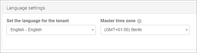

# <a name="general-setup"></a>一般設定
下列程序提供您設定 [!INCLUDE[Adallom1](./includes/adallom1_md.md)] 以使用雲端環境的指示。  
  
## <a name="prerequisites"></a>必要條件  
  
-   組織必須擁有 Cloud App Security 的授權，才能使用該產品。 如需詳細資訊，請參閱[如何購買 Cloud App Security](https://www.microsoft.com/server-cloud/products/cloud-app-security/default.aspx) 並查看[授權資源](https://www.microsoft.com/server-cloud/products/cloud-app-security/default.aspx)。  
  
     如需租用戶啟用支援，請參閱[連絡商務用 Office 365 支援人員 - 系統管理協助](https://support.office.com/article/Contact-Office-365-for-business-support-Admin-Help-32a17ca7-6fa0-4870-8a8d-e25ba4ccfd4b)。  
  
> [!NOTE] 
> Cloud App Security 不需要 Office 365 授權。  
  
-   您購買 Cloud App Security 授權之後，會收到一封電子郵件，其中附有啟用資訊和 Cloud App Security 入口網站的連結。  
  
-   若要設定 Cloud App Security，您必須是 Azure Active Directory 或 Office 365 的全域管理員、規範管理員或安全性系統管理員。 請務必了解，獲指派管理員角色的使用者將會在您組織已訂閱的所有雲端應用程式都擁有相同的權限，而不論您是在 Office 365 入口網站、Azure 傳統入口網站，還是使用 Windows PowerShell 的 Azure AD 模組來指派角色。 如需詳細資訊，請參閱[在 Office 365 中指派管理員角色](https://support.office.com/article/Assigning-admin-roles-in-Office-365-eac4d046-1afd-4f1a-85fc-8219c79e1504)和[在 Azure Active Directory 中指派管理員角色](https://azure.microsoft.com/documentation/articles/active-directory-assign-admin-roles/)。  
  
-   若要執行 Cloud App Security 入口網站，請使用 Internet Explorer 11、Microsoft Edge (最新)、Google Chrome (最新)、Mozilla Firefox (最新) 或 Apple Safari (最新)。  
  
-   ExpressRoute  
  
     Cloud App Security 部署在 Azure 中並完全整合到 [ExpressRoute](https://azure.microsoft.com/documentation/articles/expressroute-introduction/)。 與 Cloud App Security 應用程式的所有互動和傳送至 Cloud App Security 的流量，包括上傳探索記錄檔，都會透過 ExpressRoute **公用對等互連**路由傳送以改善延遲、效能和安全性。 客戶端不需要任何組態步驟。  
    如需公用對等互連的詳細資訊，請參閱 [ExpressRoute 線路和路由網域](https://azure.microsoft.com/documentation/articles/expressroute-circuit-peerings/)。  
  
## <a name="set-up-the-portal"></a>設定入口網站  
  
1.  若要存取 Cloud App Security 入口網站，請前往 [https://portal.cloudappsecurity.com](https://portal.cloudappsecurity.com)。  
  
     或者，您可以透過 **Office 365 系統管理中心**存取入口網站，方法是依序按一下系統管理中心圖示  和 [Cloud App Security]。  
  
       
  
2.  在 Cloud App Security 入口網站的功能表列中，按一下設定圖示 ，然後選取 [一般設定] 設定下列項目︰  
  
3.  **組織詳細資料**  
  
     請務必提供您組織的**組織顯示名稱**。 它將會顯示在系統傳送的電子郵件和網頁上。  
  
     提供**環境名稱** (租用戶)。 如果您管理多個租用戶，這點尤其重要。  
  
     新增**管理網域**的清單。 受管理的網域用來協助 Cloud App Security 判斷哪些使用者是內部使用者、哪些是外部使用者，以及檔案應該和不應共用的位置。 這用於報告及警示。  
> [!NOTE] 
> 網域中未設定為內部的使用者將會標示為外部，而且不會掃描活動或檔案。
   
您也可以提供**標誌**，它將會顯示在從系統傳送的電子郵件通知和網頁上。 標誌應該是大小上限為 150 x 50 像素且為透明背景的 png 檔案。  
  
4.  **活動記錄電子郵件隱私權設定**  
  
     從 Exchange online 偵測到電子郵件時，可以設定顯示方式，以維持隱私權。 可以設定顯示電子郵件時要使用**經過遮罩處理的主旨行**、**完整主旨行**，還是**只依識別碼**。  
  
       
  
5.  **地區和語言設定**  
  
     設定要用於入口網站的預設**語言**。 若要修改特定管理員的語言，請移至 [使用者設定]  >  [帳戶設定]。  
  
       
  
     設定 [主要時區]。 Cloud App Security 會持續分析和彙總資料。 根據預設，Cloud App Security 入口網站的時區設定為 UTC。 請務必設定主要時區，這可讓 Cloud App Security 準確地記錄系統事件的日期。 例如，在活動圖表中，資料依日期組織 - 這些日期會受到您系統時區的影響，因此如果您未修改預設時區，您的資料將會根據 UTC 時區組織成 24 小時制的日期，這可能會讓您的資料扭曲數個小時。  
  
       
  
6.  如果您在任何時間點想要備份入口網站設定，此畫面可讓您執行此作業。 按一下 [匯出入口網站設定] 來建立所有入口網站設定的 json 檔案，包括原則規則、使用者群組和 IP 位址範圍。  
  
       
  
7.  若要將其他管理員新增至 Cloud App Security，請按一下設定齒輪 ，然後按一下 [管理管理員存取權]。 新增應該可以存取 Cloud App Security 的管理員，然後按一下 [關閉]。  
>[!NOTE]
>任何非受邀使用者 (使用適當角色 - 全域管理員、安全性系統管理員、相容性管理員) 都可以邀請其他使用者加入 Cloud App Security。
  
  
  
##  <a name="a-nameadminsettingsa-customize-your-admin-settings"></a> 自訂管理設定  
若要將您的喜好設定設定為 Cloud App Security 的管理員，請在入口網站功能表列中按一下您的名稱，然後選取 [使用者設定] 來進行下列設定︰  
  
1.  按一下 [帳戶設定]。 這裡，您可以自訂入口網站語言以供自己檢視。 您可以將它設定為以預設語言顯示入口網站，或者自行設定不同的語言。  
  
       
  
2.  按一下 [通知] 然後針對從系統收到的電子郵件，設定電子郵件和文字通知喜好設定。  您可以設定要接收電子郵件的警示和違規的嚴重性 - 嚴重性會針對每個原則設定，因此當觸發違規時，您將視此處的設定以及遭到違反之原則中的嚴重性設定，而收到電子郵件通知。 電子郵件會傳送給與您用來登入 Cloud App Security 之管理員使用者帳戶相關聯的別名。 輸入電話號碼，以讓 Cloud App Security 能在傳送警示和通知時傳送簡訊給您，並設定您要透過簡訊接收通知的嚴重性層級。  
  
> [!NOTE] 
> 每個電話號碼每天透過簡訊傳送的警示數目上限是 10。 請注意，會根據 UTC 時區來計算日期。 
  
    
  
  
3. 完成時按一下 [儲存]。  
  
##  <a name="a-nameiptagsandrangesa-organize-the-data-according-to-your-needs"></a> 根據您的需求組織資料  
若要輕鬆找出已知的 IP 位址，例如您的實體辦公室 IP 位址，您需要設定 IP 位址範圍，讓您能標記並適當地分類，以及自訂記錄檔和警示顯示與調查的方式。   
每個 IP 範圍群組可根據預先設定的 IP 類別清單來分類，或是以您自己建立的 IP 標記加以標記。 此外，此設定可讓您根據您的內部網路知識，覆寫公用地理位置資訊。  
  
可支援 IPv4 和 IPv6。  
  
在功能表列中，按一下設定圖示 ，然後選取 [IP 位址範圍]。 按一下 [+新增 IP 位址範圍] 並進行下列設定︰  
  
> [!NOTE]  
>  位置和已註冊的 ISP 會覆寫預設值。   
> 不過，IP 標記會新增至活動而不會覆寫資料。  
  
1.  **命名**您的 IP 範圍。 名稱不會出現在活動記錄檔，它只用於管理您的 IP 範圍。  
  
     若要將 IP 範圍包含在 IP 類別中，請從下拉式功能表選取類別。  
  
2.  輸入您想要設定的 [IP 位址範圍]，然後按一下 "+" 按鈕。 您可以使用網路首碼表示法 (也稱為 CIDR 表示法) 新增任意數目的 IP 位址和子網路，例如 192.168.1.0/32。  
  
3.  若要覆寫這些位址的 [位置] 或 [組織 (ISP)] 欄位，請輸入新值。 例如，如果您的 IP 位址被公開認為在愛爾蘭，但您知道它是在美國，您可以覆寫此設定。  
  
4.  輸入 [已註冊的 ISP]。 這會覆寫您活動中的資料  
  
5.  若要**標記**來自這些 IP 位址的活動，請輸入標記。 在方塊中輸入文字即可建立標記。 您已經設定標記之後，就可以從清單中選擇它，輕鬆地將它新增到其他 IP 範圍。 您可以為每個範圍新增任意數量的 IP 標記。 建立原則時，可以使用 IP 標記。  
  
     內建的 Cloud App Security **IP 標記**會針對高風險的位址而設定，並且會經常更新。 這些標記包含匿名 Proxy、衛星提供者、Tor 結束節點，以及 Cloud App Security Proxy 網路。 您看不到這些內建標記。  
  
6.  **IP 類別**可用來輕鬆地辨識來自有趣 IP 位址的活動。 類別可在入口網站取得，但需要使用者設定才能決定哪些 IP 位址會包含在每個類別中，「風險」類別除外，它包含兩個 IP 標記 - 匿名 Proxy 和 Tor。  
  
     可以使用下列 IP 類別︰  
  
    -   **系統管理**︰這些應為您管理員的所有 IP 位址。  
  
    -   **內部**︰這些應為您的內部網路、分公司和 Wi-Fi 漫遊位址的所有 IP 位址。  
  
    -   **風險**︰這些應為任何您視為危險的 IP 位址。 它們可以包含您在過去已看到的可疑 IP 位址、競爭對手網路中的 IP 位址等等。  
  
    -   **VPN**︰這些應為您用於遠端工作者的任何 IP 位址。  
  
    -   **雲端 Proxy**︰這應該是您雲端 Proxy 的 IP 位址。  
  
7.  完成時按一下 [建立]。  
  
       
  
##  <a name="a-nameadallommailsettingsa-personalize-your-experience"></a> 個人化您的體驗  
在功能表列中，按一下設定圖示 ，然後選取 [郵件設定]，以針對從 Cloud App Security 傳送給管理員要求警示的電子郵件通知，還有傳送給使用者與他們相關的缺口通知中來設定參數。  
  
  
  
設定下列各項：  
  
1.  **寄件者電子郵件地址**︰您想要用來傳送通知的電子郵件帳戶。  
  
     **寄件者顯示名稱**︰您想要顯示在電子郵件 [寄件者] 欄位中的名稱。  
  
     **回覆電子郵件地址**︰要用於訊息回覆的電子郵件帳戶。  
  
       
  
2.  您可以使用 HTML 檔案，以自訂和設計從系統傳送的電子郵件。 用於範本的 HTML 檔案應該包含下列項目︰  
  
    -   所有範本 CSS 都應內嵌在範本中。  
  
    -   範本中應該有三個無法編輯的預留位置︰  
  
         %%logo%% - 在 [一般設定] 頁面中已上傳之公司標誌的 URL。  
  
         %%title%% - 電子郵件標題的預留位置，由原則所設定。  
  
         %%content%% - 針對一般使用者所包含內容的預留位置，其由原則所設定。  
  
     範例電子郵件範本如下︰  
  
    ```  
    <!DOCTYPE html PUBLIC "-//W3C//DTD XHTML 1.0 Transitional//EN" "http://www.w3.org/TR/xhtml1/DTD/xhtml1-transitional.dtd">  
    <html>  
    <head>  
      <meta http-equiv="Content-Type" content="text/html; charset=UTF-8"/>  
      <meta name="viewport" content="width=device-width, initial-scale=1.0"/>  
    </head>  
    <body class="end-user">  
    <table border="0" cellpadding="20%" cellspacing="0" width="100%" id="background-table">  
      <tr>  
        <td align="center">  
          <!--[if (gte mso 9)|(IE)]>  
          <table width="600" align="center" cellpadding="0" cellspacing="0" border="0">  
            <tr>  
              <td>  
          <![endif]-->  
          <table bgcolor="#ffffff" align="center" border="0" cellpadding="0" cellspacing="0" style="padding-bottom: 40px;" id="container-table">  
            <tr>  
              <td align="right" id="header-table-cell">  
                  
              </td>  
            </tr>  
            <tr>  
              <td style="padding-top: 58px;" align="center" valign="top">  
                <table width="100%" cellpadding="12">  
                  <tr>  
                    <td align="center" class="round-title">  
                      %%title%%  
                    </td>  
                  </tr>  
                </table>  
              </td>  
            </tr>  
            <tr>  
              <td style="padding: 0 40px 79px 40px;" class="content-table-cell" align="left" valign="top">  
                  %%content%%  
              </td>  
            </tr>  
            <tr>  
              <td class="last-row"></td>  
            </tr>  
          </table>  
          <!--[if (gte mso 9)|(IE)]>  
          </td>  
          </tr>  
          </table>  
          <![endif]-->  
        </td>  
      </tr>  
    </table>  
    </body>  
    </html>  
  
    ```  
  
3.  按一下 [上傳範本...] ，然後選取您建立的檔案。  
  
     然後按一下 [傳送測試電子郵件]，傳送測試電子郵件給自己，以查看您所建立範本的範例。  
     電子郵件將傳送至您用來登入入口網站的帳戶。 在測試電子郵件中，您將能夠看到中繼資料欄位、範本、電子郵件主旨、電子郵件內文中的標題，以及內容。  
  
## <a name="single-signon"></a>單一登入  
Cloud App Security 搭配 Azure Active Directory 一起進行驗證、佈建和授權相關的活動。 如需如何管理單一登入的相關資訊，請參閱 [Azure Active Directory 同盟相容性清單：可用來實作單一登入的協力廠商身分識別提供者](https://msdn.microsoft.com/library/azure/jj679342.aspx)。  
  
## <a name="see-also"></a>另請參閱  
[設定 Cloud Discovery](set-up-cloud-discovery.md)   
[如需技術支援，請前往 Cloud App Security 的輔助支援頁面](http://support.microsoft.com/oas/default.aspx?prid=16031)。   
[Premier 客戶也可以直接從 Premier 支援入口網站選擇 Cloud App Security。](https://premier.microsoft.com/)  
  
  


<!--HONumber=Oct16_HO5-->


