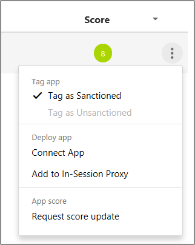

# 調查
當 Cloud App Security 在雲端環境上執行之後，您需要學習及調查如何使用 Cloud App Security 的工具深入了解雲端環境中發生的一切。 然後根據特定的環境及其使用狀況，您可以找出必要需求，保護貴組織免於風險威脅。  

本文說明如何執行深入探討調查，以深入了解雲端環境。  

## 儀表板  
下列儀表板可協助您調查雲端環境中的應用程式︰  

|儀表板|描述|  
|---------------|-----------------|  
|主要儀表板|雲端狀態 (使用者、檔案、活動) 及必要動作 (警示、活動違規及內容違規) 概觀|  
|應用程式儀表板：整體|每個位置的應用程式使用情況、每數個使用者的使用量圖形概觀|  
|應用程式儀表板：見解|儲存在應用程式的資料分析，依檔案類型及檔案共用層級細分|  
|應用程式儀表板：檔案|向下切入檔案內，能夠根據擁有者、共用層級等進行篩選，以及執行治理動作 (例如隔離)|  
|應用程式儀表板：協力廠商應用程式|向下切入目前部署的協力廠商應用程式內，例如 Google 應用程式並為其定義原則|  
|使用者儀表板|完整的雲端使用者設定檔概觀，包括群組、位置、最近的活動、相關警示及所用瀏覽器|  

##   批准或未批准應用程式  
了解您雲端的第一個步驟是批准應用程式。 批准應用程式之後，您就可以篩選未批准的應用程式，開始移轉同類型的已批准應用程式。  

-   在 Cloud App Security 主控台中，依序選擇 **[探索]** 及 **[探索儀表板]**。  

-   在探索到的應用程式清單中，於您要批准的應用程式出現的資料列中，選擇資料列結尾的三個點 ，然後選取 **[標示為已許可]**。  

       

> [!NOTE]  
>  建議您為每個想要使用 Cloud App Security API 整合監視的應用程式，建立 Cloud App Security 專用的管理服務帳戶。  

## 使用調查工具  

1.  在 Cloud App Security 入口網站中，移至 [調查]，然後查看 [活動記錄] 並依特定應用程式進行篩選。 檢查下列項目：  

    -   誰在存取您的雲端環境？  

    -   從什麼 IP 範圍？  

    -   什麼是管理員活動？  

    -   管理員從哪些位置連線？  

    -   是否有任何過時的裝置連接至雲端環境？  

    -   失敗的登入是否來自預期的 IP 位址？  

2.  請依序移至 [調查] 和 [檔案]，並檢查下列項目︰  

    -   有多少檔案公開共用，以便任何人都可以不用連結即可存取它們？  

    -   您與哪些夥伴共用檔案 (連出共用)？  

    -   有任何檔案具機密名稱嗎？  

    -   是否有任何檔案以某人的個人帳戶共用？  

3.  請依序移至 [調查] 和 [帳戶]，並檢查下列項目︰  

    -   是否有任何帳戶在特定服務中長時間處於非使用狀態？ (也許您可以撤銷該使用者對該服務的授權？)  

    -   您想要知道哪些使用者有特定角色嗎？  

    -   是否有解聘人員仍可存取應用程式，並可利用該存取來竊取資訊？  

    -   您要撤銷使用者的特定應用程式權限，或需要特定使用者執行多重要素驗證嗎？  

4.  請移至 [調查]，然後選取一個應用程式。 應用程式儀表板隨即開啟，並提供資訊及深入見解。 您可以使用上方的索引標籤檢查下列項目︰  

       

    -   您的使用者使用何種裝置連接到應用程式？  

    -   它們在雲端中儲存何種類型的檔案？  

    -   應用程式現在進行何種活動？  

    -   您的環境是否有任何連接的協力廠商應用程式？  

    -   您熟悉這些應用程式嗎？  

    -   它們有權存取允許的層級嗎？  

    -   有多少使用者部署了它們？ 這些應用程式有多平常？  

5.  請移至 [Cloud Discovery 儀表板] 並檢查下列項目︰  

    -   目前使用哪些雲端應用程式？到什麼程度？使用者為誰？  

    -   使用目的為何？  

    -   有多少資料上傳到這些雲端應用程式？  

    -   您批准了哪些雲端應用程式類別？是否有使用者使用替代方案？  

    -   關於替代方案，貴組織是否有您不想批准的雲端應用程式？  

    -   是否有已使用但不符合貴組織原則的雲端應用程式？  

## 使用報告調查風險  
開始嘗試取得雲端環境的控制權時，您要根據希望找到的項目進行某些假設，因您還不清楚您的雲端狀況。 您要根據這些假設建立原則。

雲端環境執行 Cloud App Security 後，您便可使用內建報告 (及自訂報告) 查看您的雲端狀況。 以此為基礎，再次調整您的原則將例外狀況納入，進而降低原則攔截到的誤判量。  

內建報告提供您彙總檢視，以利調查。 若要使用內建報告，請依序前往 **[調查]** 及 **[內建報告]**。 如需各種內建報告的詳細資訊，請參閱[內建報告參考資料](built-in-report-reference.md)。  

## 調查範例  
比方說，假設您未以具有風險的 IP 位址來存取雲端環境 (例如，匿名 Proxy 及 Tor)。 但您要建立風險 IP 的原則，以確定︰  

1.  在入口網站中，移至 **[控制]** 並選擇 **[原則]**。  

2.  按一下 **[原則中心]** 的 **[範本]** 索引標籤。  

3.  在 **[使用者從未分類的 IP 位址登入]** 資料列的結尾處，選擇加號 (**+**) 建立新的原則。  

4.  變更原則名稱，以便識別此原則。  

5.  選擇 **[活動篩選]** 下的 [+] 新增篩選。 向下捲動到 **[IP 標記]**，然後選擇 **[匿名]** 及 **[Tor]**。  

       

現在原則已就位，但您卻嚇然發現收到違反原則的警示。  

1.  請移至 [警示] 頁面，檢視有關原則違規的警示。  

2.  如果您發現它看起來像真正的違規，您就要包含風險或修復。  

     若要包含風險，您可以通知使用者，詢問是否故意違規，以及使用者是否知情。  

     您也可以向下切入至警示並暫停使用者，直到您找出需要完成的事項。  

3.  如果是允許但不一定重複發生的事件，您可以關閉警示。  

     若為受允許且預期會重複發生的事件，您可以變更原則，讓此類型事件日後不會視為違規。  

## 另請參閱  
如需了解如何控制貴組織的雲端應用程式，請參閱[控制項](control.md)。   
如需技術支援，請前往 [Cloud App Security 的輔助支援](http://support.microsoft.com/oas/default.aspx?prid=16031)頁面。  
頂級客戶也可以直接從[頂級支援入口網站](https://premier.microsoft.com/)選擇 Cloud App Security。  

<!--HONumber=Nov16_HO3-->

