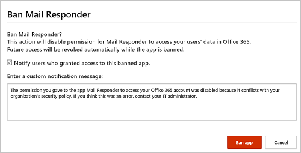

# 管理應用程式權限
許多可能由組織中的商務使用者安裝的第三方生產力應用程式會需要權限，才能存取使用者資訊及資料，以及以其他雲端應用程式 (例如 Office 365、G Suite 和 Salesforce) 使用者的身分登入。  當使用者安裝這些應用程式時，通常不會仔細檢閱提示中的詳細資料 (包括授權給應用程式的資料) 就按下 [接受]。  因為 IT 沒有足夠深入解析資訊可以對應用程式的安全性風險，以及應用程式所提供的生產力優點來進行權衡。 因為接受第三方應用程式權限對您的組織而言為潛在的安全性風險，所以監視您使用者所授與的應用程式權限，讓您可以執行必要的監視及控制，從而保護您的使用者與您的應用程式。 Cloud App Security 應用程式權限讓您可以查看哪些使用者安裝的應用程式具有 Office 365 資料的存取權、G Suite 資料和 Salesforce 資料，應用程式有哪些權限，和哪些使用者授權這些應用程式存取 Office 365、G Suite 和 Salesforce 帳戶。 應用程式權限可讓您決定您的使用者可以或不可以存取哪些應用程式。

## 使用應用程式權限頁面

[應用程式權限] 頁面會顯示您連線應用程式中的應用程式權限相關資訊。

若要存取 [應用程式權限] 索引標籤：

在 Cloud App Security 入口網站中，依序按一下 [調查] 和 [應用程式權限]。

 

[應用程式權限] 頁面提供每一個獲授與權限之第三方應用程式的相關資訊：

|項目|代表的意義|適用對象|
|-------|-------|-------|
|應用程式查詢列中的基本圖示  |選取此圖示可切換到基本檢視中執行查詢。|Office 365、G Suite、Salesforce|
|應用程式查詢列中的進階圖示  |選取此圖可切換到進階檢視中執行查詢。|Office 365、G Suite、Salesforce|
|應用程式清單中的開啟或關閉所有詳細資料圖示  |選取此圖示可切換顯示每個應用程式較多或較少的詳細資訊。|
|應用程式清單中的匯出圖示  |選取此圖示可匯出內含應用程式清單、每個應用程式的使用者人數、應用程式相關聯的權限、權限等級、應用程式狀態及社群使用頻率的 CSV 檔案。|Office 365、G Suite、Salesforce|
|應用程式|應用程式的名稱。 選取此名稱可檢視更多資訊，包括描述、發行者 (適用於 Office 365)、應用程式網站及識別碼。|Office 365、G Suite、Salesforce|
|授權者|授權此應用程式可以存取其應用程式帳戶，以及授與應用程式權限的使用者人數。 選取數量可檢視更多資訊，包括使用者電子郵件的清單，以及系統管理員先前是否已經同意此應用程式。|Office 365、G Suite、Salesforce|
|權限等級  |此權限等級圖示及文字會指出高、中、低。 層級指出此應用程式對於應用程式資料的存取範圍。 例如，「低」表示此應用程式只能存取使用者設定檔及名稱。 選取層級可檢視詳細資訊，包括授與應用程式的權限、社群使用，或[治理記錄](governance-actions.md)中的相關活動。|Office 365、G Suite|
|應用程式狀態|系統管理員可以將應用程式標示為已核准、已禁止或未定。|Office 365、G Suite、Salesforce|
|社群使用|如果您想要知道此應用程式在您所有使用者之間的熱門程度 (經常、不常、很少)，請選取此選項|Office 365、G Suite、Salesforce|
|上次授權日期|使用者最近授權給此應用程式的日期。|Office 365、Salesforce|
|發行者|提供應用程式的廠商名稱。|Office 365|
|上次使用日期|組織中任何人最近使用此應用程式的日期。|Salesforce|

## 禁止或核准應用程式
1. 在 [應用程式權限] 頁面中按一下應用程式，可開啟應用程式下拉式清單，以檢視應用程式及其獲授與之權限的詳細資訊。 您可以按一下 [權限] 連結，檢視授與該應用程式之權限的完整清單。 在社群中使用時，您可以檢視應用程式在其他組織的普及狀況。 您也可以按一下 [相關活動] 連結，檢視與此應用程式相關之治理記錄中所列出的活動。
2. 若要禁止此應用程式，請按一下表格中應用程式列結尾的禁止圖示。   
    
當您禁止應用程式時，可以選擇是否要讓使用者知道其先前所安裝及授權的應用程式已被禁止，即將予以停用，而且無法再行存取連線應用程式。 若您不想告知使用者，可在 [禁止應用程式] 對話方塊中，取消選取 [通知先前授與此遭禁應用程式存取權的使用者]。

    
> [!Note]
> 建議您讓應用程式的使用者其應用程式將被禁止，無法再行使用。

3. 若要核准應用程式，可按一下表格中應用程式列結尾的核准圖示。   
    
圖示會轉變成綠色，表示應用程式已獲核准，可供您的所有連線應用程式使用者使用。
> [!Note]
> 將應用程式標記為已核准對使用者沒有影響。 其目的只在讓您可以圖像方式標記您核准的應用程式，與您尚未審核的應用程式加以區分。

3. 請在 [輸入自訂通知訊息] 方塊中輸入您想要傳送給應用程式使用者的訊息，並視需要更新通知電子郵件的回覆地址。 
 按一下 [禁止應用程式] 會傳送郵件，禁止您的連線應用程式使用者使用該應用程式。

## 撤銷應用程式並通知使用者

針對 G Suite 和 Salesforce，您可以撤銷應用程式的權限，或通知使用者應完成此動作。 

1. 在 [應用程式權限] 頁面上，按一下應用程式資料列結尾的三個點，然後選取 [通知使用者]。 根據預設，使用者會收到通知，如下所示：「您已授權應用程式 Adallom Google Protector 存取您的 G Suite 帳戶。*此應用程式與您組織的安全性原則衝突。請重新考慮提供或撤銷在 G Suite 帳戶中為此應用程式所提供的權限。若要撤銷應用程式存取權，請前往：https://security.google.com/settings/security/permissions?hl=en&pli=1  選取應用程式，然後按一下右方功能表列中的 [撤銷存取權]。* 您可以自訂所傳送的訊息。
2. 您也可以撤銷使用者使用應用程式的權限，方法是按一下資料表中應用程式資料列結尾的圖示，然後選取 [撤銷應用程式]。 

 

## 查詢應用程式權限

您可以在 [基本] 檢視或 [進階] 檢視中查詢應用程式權限。 在 [基本] 檢視中，從一或多個下拉式清單中選取值，可顯示特定的應用程式。 在進階檢視中，使用 [選取篩選] 下拉式清單縮小搜索範圍。 新增運算子 (等於或不等於選取的值) 來完成查詢。

- 選擇**新增篩選**圖示可新增額外的篩選，進一步縮小搜尋範圍。 篩選會自動套用，應用程式清單也會隨之更新。

- 選擇位於篩選旁的**移除篩選**圖示，可移除篩選。

## 另請參閱  
[使用原則來控制雲端應用程式](control-cloud-apps-with-policies.md)   
[如需技術支援，請前往 Cloud App Security 的輔助支援頁面。](http://support.microsoft.com/oas/default.aspx?prid=16031)   
[Premier 客戶也可以直接從 Premier 支援入口網站選擇 Cloud App Security。](https://premier.microsoft.com/)  
  
  