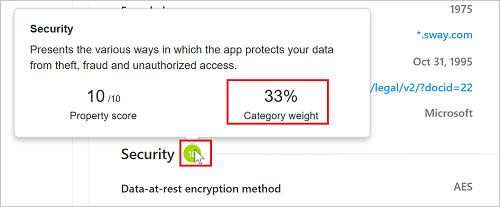

# 使用風險分數  

## 雲端應用程式目錄

雲端應用程式目錄可讓您完整查看 Cloud Discovery 所識別的項目。 Cloud Discovery 會分析您的流量記錄，而其分析依據是根據 50 個以上屬性進行排名和評分之 14,000 個雲端應用程式的 Cloud App Security 雲端應用程式目錄，以讓您持續取得雲端使用、Shadow IT 以及 Shadow IT 對組織造成之風險的可見度。
[雲端應用程式目錄] 會依據認證法規、業界標準和最佳做法來進行雲端應用程式的風險分級。 在雲端應用程式目錄中執行四種補充程序，以保持最新資訊︰
1.  直接從雲端應用程式進行自動化資料擷取 (適用於 SOC 2 相容性這類屬性)。
2.  透過 Cloud App Security 演算法之資料的自動化進階資料擷取 (適用於 HTTP 安全性標頭這類屬性)。
3.  Cloud App Security 雲端分析師團隊進行的連續分析 (適用於靜止加密這類屬性)。
4.  客戶型修訂要求 (根據雲端應用程式目錄變更的客戶提交要求)。 所有要求都是由雲端分析師團隊所檢閱，並根據其發現的項目進行更新。
  
  

雲端應用程式的業務單位需求，因為其變更需求的解決方案會持續成長。 雲端應用程式目錄可讓您明智地選擇哪些應用程式符合您組織的安全性需求，以及最新安全性標準、弱點和入侵必須為最新狀態的需求。 例如，如果您想要比較 CRM 應用程式，並確定它們受到充分保護，則可以使用 [雲端應用程式目錄] 頁面來篩選您想要的相關應用程式：在 [雲端應用程式目錄] 頁面的 [依類別瀏覽] 下，選取 [CRM]。 

接著，使用 [進階] 篩選，然後設定 [合規性風險因素] > [SOC 2 等於 True]；[合規性風險因素] > [ISO 27001 等於 True]；[安全性風險因素] > [待用資料加密等於 True]；[安全性風險因素] > [待用資料加密等於 True]；[安全性風險因素] > [管理稽核線索等於 True]，而且 [安全性風險因素] > [使用者稽核線索等於 True]。

篩選結果之後，您可以檢閱相關應用程式，並找出最適合您需求的應用程式。

## 雲端應用程式目錄篩選

有基本和進階雲端應用程式目錄篩選。 若要取得複雜的篩選，請使用包括下列各項的進階選項：

- **應用程式標籤**：標籤可讓您自訂「雲端應用程式目錄」。 
  您可以選取 [Sanctioned (核准)]、[Unsanctioned (不核准)]，也可以建立應用程式的自訂標籤。 接著可以使用這些標籤作為篩選，以深入探討您想要調查的特定應用程式類型。 
- **應用程式與網域**：可讓您搜尋特定應用程式或用於特定網域的應用程式。 
- **類別**：類別篩選位於頁面左邊，可讓您根據應用程式類別搜尋不同類型的應用程式，例如社交網路應用程式、雲端儲存體應用程式等。您可以一次選取多個類別或單一類別，然後將基本和進階篩選套用其上。
- **合規性風險因素**：可讓您搜尋應用程式可能遵守的特定標準、憑證與規範 (HIPAA、ISO 27001、SOC 2、PCI-DSS 等)。
- **一般風險因素**：可讓您搜尋一般風險因素，例如消費者歡迎程度、資料中心地區設定等。
- **風險分數**：可讓您依風險分數篩選應用程式，以便專注在只檢閱高風險的應用程式。
- **安全性風險因素**：可讓您根據特定安全措施 (例如待用資料加密、多重要素驗證等) 進行篩選。

## 建議變更

如果您在環境中發現 Cloud App Security 尚未計分的新應用程式、新的風險因素或分數更新，或過期的應用程式資料，則可以要求檢閱應用程式：

**建議新的應用程式：**
1. 在 [探索到的應用程式] 頁面頂端，按一下三個點，然後選取 [建議新的應用程式]。 

  

2. 在 [建議新的雲端應用程式] 快顯視窗中，填入新應用程式的詳細資料，包括應用程式的名稱和網域。 

  

3. 建議選取讓 Cloud App Security 分析師在需要應用程式其他資訊時連絡您的核取方塊，以於分析完成時向您進行更新。

**更新風險因素、分數或更新應用程式資料：**

1. 在 [雲端應用程式目錄] 頁面中，於您想要更新的應用程式資料列中，按一下資料列結尾的三個點，然後選取 [要求分數更新]。

  

2. 在 [建議改進] 快顯視窗中，選取您是否想要要求分數更新、建議新的風險因素，或更新應用程式資料。

  

3. 建議選取讓 Cloud App Security 分析師在需要應用程式其他資訊時連絡您的核取方塊，以於分析完成時向您進行更新。
 

## 自訂風險分數

Cloud Discovery 提供供整個環境使用之雲端應用程式可信度及可靠性的重要資料。 在入口網站中，每個探索到的應用程式都會顯示總分數，代表此特定應用程式的企業運用成熟度的 Cloud App Security 評估。 任何指定應用程式的總分數，都是評估可靠性時，Cloud App Security 考慮的三個子類別之三項子分數的加權平均︰  
  
-   **一般** - 此類別是指有關公司生產應用程式的基本事項，包括其網域、創建年份和熱門程度。 這些欄位意在展現公司最基本層面的穩定性。  
  
-   **安全性** - 安全性類別會考量探索到的應用程式所用之資料實體安全性的所有處理標準。 這包括多重要素驗證、加密、資料分類和資料所有權等欄位。  
  
-   **相容性** - 此類別可顯示生產應用程式的公司支持哪些常見的法規標準最佳做法。 規格清單包含 HIPAA、CSA 和 PCI-DSS 等標準。  
  
每個類別都包含許多特定的屬性。 根據我們的評分法，每個屬性會獲得 0 到 10 的初始分數，視值而定。 True/False 值分別會得到 10 或 0，而連續的屬性，例如網域使用期限，會得到範圍內的特定值。 每個屬性的分數會根據類別中所有其他現有欄位加權，以建立類別的子分數。 如果您遇到未計分的應用程式，通常表示應用程式的內容為未知，因此不予計分。  
  
請務必花點時間檢閱並修改 Cloud Discovery 分數設定的預設權重。 評估的各種參數預設都有相同的權重。 如有特定參數對貴組織而言需增加或減少其重要性，請務必如下所示變更其權重︰  
  
1.  在入口網站的設定圖示下，選取 [Cloud Discovery 設定]。  
  
2.  滑動 [設定分數計量] 下的 [重要性]，將欄位或風險類別的權重變更為 [已略過]、[低]、[中]、[高] 或 [非常高]。  
  
3.  此外，您可以在分數計算中設定特定值為無法使用或不適用。 包含時，N/A 值對計算的分數有負比重。  
  
    

您可以在 Cloud App Security 入口網站中，取得了解如何往上堆疊風險分數所需的所有資訊。
若要深入了解特定風險分類中風險因素的權重，請使用應用程式設定檔中每個欄位名稱右邊的 [i] 按鈕。 這會提供 Cloud App Security 如何針對特定風險因素進行計分的確切資訊。 分數是風險因素在 1-10 級別中的值 + 它在風險分類中的權重：

  
若要了解風險類別在應用程式總分數中的權重，請將滑鼠停留在風險分類分數上方：

## 覆寫風險分數
您可以覆寫應用程式的風險分數，而不需要變更其加權方式，即可取得組織的立即結果。 例如，如果您使用之 LOB 應用程式的風險分數為 8，而且您的組織批准且鼓勵使用它，則可能會想要將風險分數變更為 10。 

若要覆寫風險分數，請在 [探索到的應用程式] 表格或 [雲端應用程式目錄] 中按一下任何應用程式右邊的三個點，然後選取 [Override risk score (覆寫風險分數)]。

在您更新分數之後，即可包括應用程式附註，讓其他系統管理員更清楚修改此應用程式分數的業務理由。 

您也可以新增附註，以在任何人檢閱應用程式時清楚變更理由。

 
## 另請參閱  
[可保護雲端環境的日常活動](daily-activities-to-protect-your-cloud-environment.md)   
[如需技術支援，請前往 Cloud App Security 的輔助支援頁面。](http://support.microsoft.com/oas/default.aspx?prid=16031)   
[Premier 客戶也可以直接從 Premier 支援入口網站選擇 Cloud App Security。](https://premier.microsoft.com/)  
  
  