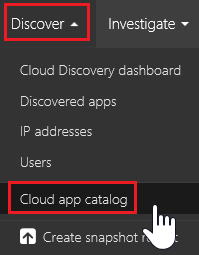
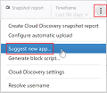

# 使用風險分數  

## 雲端應用程式目錄

若要進一步了解 Cloud App Security 的 Cloud Discovery 可以探索哪些雲端應用程式，請使用雲端應用程式目錄。

雲端應用程式目錄包含超過 14,000 個 SaaS 應用程式，您可以依據名稱、網域、風險分數、類別或可用的安全性功能來檢視 (篩選)。

## 探索要求

雲端應用程式目錄中的資訊與風險分數是以多種來源為依據。 Microsoft 致力於提供最新的資訊，但不為任何資料來源的正確性提供保證。 

如果您認為應用程式的相關資訊已過期，請與我們連絡。

-    要求分數更新 – 如果您希望我們的小組重新評估此雲端應用程式。
-    回報新資料 (針對每個特定欄位或一般) – 如果您認為應用程式的相關資訊已過期。

此外，我們鼓勵您建議增加您的組織使用但 Cloud Discovery 目前無法探索的任何雲端應用程式。

## 自訂風險分數

Cloud Discovery 提供供整個環境使用之雲端應用程式可信度及可靠性的重要資料。 在入口網站中，每個探索到的應用程式都會顯示總分數，代表此特定應用程式的企業運用成熟度的 Cloud App Security 評估。 任何指定應用程式的總分數，都是評估可靠性時，Cloud App Security 考慮的三個子類別之三項子分數的加權平均︰  
  
-   **一般** - 此類別是指有關公司生產應用程式的基本事項，包括其網域、創建年份和熱門程度。 這些欄位意在展現公司最基本層面的穩定性。  
  
-   **安全性** - 安全性類別會考量探索到的應用程式所用之資料實體安全性的所有處理標準。 這包括多重要素驗證、加密、資料分類和資料所有權等欄位。  
  
-   **相容性** - 此類別可顯示生產應用程式的公司支持哪些常見的法規標準最佳做法。 規格清單包含 HIPAA、CSA 和 PCI-DSS 等標準。  
  
每個類別都包含許多特定的屬性。 根據我們的評分法，每個屬性會獲得 0 到 10 的初始分數，視值而定。 True/False 值分別會得到 10 或 0，而連續的屬性，例如網域使用期限，會得到範圍內的特定值。 每個屬性的分數會根據類別中所有其他現有欄位加權，以建立類別的子分數。 如果您遇到未計分的應用程式，通常表示應用程式的內容為未知，因此不予計分。  
  
請務必花點時間檢閱並修改 Cloud Discovery 分數設定的預設權重。 評估的各種參數預設都有相同的權重。 如有特定參數對貴組織而言需增加或減少其重要性，請務必如下所示變更其權重︰  
  
1.  在入口網站的設定圖示下，選取 [Cloud Discovery 設定]。  
  
2.  滑動 [設定分數計量] 下的 [重要性]，將欄位或風險類別的權重變更為 [已略過]、[低]、[中]、[高] 或 [非常高]。  
  
3.  此外，您可以在分數計算中設定特定值為無法使用或不適用。 包含時，N/A 值對計算的分數有負比重。  
  
       

您可以在 Cloud App Security 入口網站中，取得了解如何往上堆疊風險分數所需的所有資訊。
若要深入了解特定風險分類中風險因素的權重，請使用應用程式設定檔中每個欄位名稱右邊的 [i] 按鈕。 這會提供 Cloud App Security 如何針對特定風險因素進行計分的確切資訊。 分數是風險因素在 1-10 級別中的值 + 它在風險分類中的權重：

  
若要了解風險類別在應用程式總分數中的權重，請將滑鼠停留在風險分類分數上方：

 
## 另請參閱  
[可保護雲端環境的日常活動](daily-activities-to-protect-your-cloud-environment.md)   
[如需技術支援，請前往 Cloud App Security 的輔助支援頁面。](http://support.microsoft.com/oas/default.aspx?prid=16031)   
[Premier 客戶也可以直接從 Premier 支援入口網站選擇 Cloud App Security。](https://premier.microsoft.com/)  
  
  