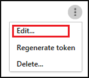

# <a name="siem-integration"></a>SIEM 整合
    
您現在可以整合 Cloud App Security 與 SIEM 伺服器，以集中監視 Office 365 警示和活動。 隨著 Office 365 所支援的新活動與事件，Cloud App Security 也會隨之推出對應的支援。 與 SIEM 服務整合可讓您進一步保護雲端應用程式，同時維護一般安全性工作流程、自動化安全性程序，以及關聯雲端型事件與內部部署事件。 Cloud App Security SIEM 代理程式會在您的伺服器上執行，以及從 Cloud App Security 提取警示和活動，並將它們串流至 SIEM 伺服器。

當您初次整合您的 SIEM 與 Cloud App Security 時，過去兩天內的活動和警示會轉寄到 SIEM，並從那時候開始轉寄所有活動和警示 (依據您選取的篩選)。 此外，如果您延長此功能的停用期間，當您再次加以啟用時，其會轉寄過去兩天內的警示和活動，接著轉寄那時候開始的所有警示和活動。

## <a name="siem-integration-architecture"></a>SIEM 整合架構

SIEM 代理程式會部署在您的組織網路中。 部署並設定好 SIEM 代理程式之後，代理程式便會提取使用 Cloud App Security RESTful API 所設定的資料類型 (警示與活動)。
之後，便會透過連接埠 443 上加密的 HTTPS 通道進行流量傳輸。

SIEM 代理程式從 Cloud App Security 擷取資料後，便會使用您在安裝期間提供的網路設定 (搭配自訂連接埠的 TCP 或 UDP)，傳送 Syslog 訊息至本機 SIEM。 


## <a name="how-to-integrate"></a>如何整合

與 SIEM 整合是透過三個步驟完成︰
1. 在 Cloud App Security 入口網站中進行設定。 
2. 下載 JAR 檔案，並在您的伺服器上執行該檔案。
3. 驗證 SIEM 代理程式正在運作。

### <a name="prerequisites"></a>必要條件

- 標準 Windows 或 Linux 伺服器 (可以是虛擬機器)。
- 伺服器必須執行 Java 8；不支援舊版本。

## <a name="integrating-with-your-siem"></a>與 SIEM 整合

### <a name="step-1-set-it-up-in-the-cloud-app-security-portal"></a>步驟 1：在 Cloud App Security 入口網站中進行設定

1. 在 Cloud App Security 入口網站中，按一下設定齒輪下的 [安全性延伸模組]，然後按一下 [SIEM 代理程式] 索引標籤。

2. 按一下加號圖示以啟動 [新增 SIEM 代理程式精靈]。
3. 在精靈中，按一下 [Add SIEM agent]\(新增 SIEM 代理程式)。 
4. 在精靈中，填入名稱，並**選取 SIEM 格式**，然後設定與該格式相關的任何 [進階設定]。 按 [下一步] 。

   

5. 輸入 [遠端 Syslog 主機] 的 IP 位址或主機名稱，以及 [Syslog 連接埠號碼]。 選取 TCP 或 UDP 作為遠端 Syslog 通訊協定。
如果您沒有這些詳細資料，則可以與安全性系統管理員合作，來取得這些詳細資料。
按 [下一步] 。
  

6. 選取您想要匯出至 SIEM 伺服器的資料類型：[警示] 和 [活動]。 使用滑桿來啟用和停用它們，預設會選取所有項目。 您可以使用 [套用至] 下拉式清單來設定篩選條件，以便只將特定警示和活動傳送至 SIEM 伺服器。
您可以按一下 [Edit and preview results]\(編輯和預覽結果)，檢查篩選是否如預期運作。 按 [下一步] 。 

  

7. 複製並儲存權杖，以供稍後使用。 按一下 [完成] 並離開精靈之後，回到 SIEM 頁面就可以在表格中看到您新增的 SIEM 代理程式。 在稍後連接之前，它會顯示為 [已建立]。

### <a name="step-2-download-the-jar-file-and-run-it-on-your-server"></a>步驟 2：下載 JAR 檔案，並在您的伺服器上執行該檔案

1. [從 Microsoft 下載中心下載 .zip 檔案](https://go.microsoft.com/fwlink/?linkid=838596)，並將它解壓縮。

2. 從 ZIP 檔案中解壓縮 .jar 檔案，並在您的伺服器上執行該檔案。
 在執行這個檔案之後，請執行下列命令︰
    
      java -jar mcas-siemagent-0.87.20-signed.jar [--logsDirectory DIRNAME] [--proxy ADDRESS[:PORT]] --token TOKEN
> [!NOTE]
> - 根據 SIEM 代理程式的版本，檔名可能會不同。
> - 方括弧 [  ] 中的參數是選擇性的，應只在相關情況下使用。
> - 建議在伺服器啟動期間執行 JAR。
>   - Windows：當成排程工作執行，確定工作設定為 [Run whether the user is logged on or not] (不論使用者登入與否均執行) 並且取消核取 [Stop the task if it runs logner than] (停止工作，如果執行時間超過) 核取方塊。
>   - Linux：將帶有 **&** 的執行命令新增至 rc.local 檔案。 例如：`java -jar mcas-siemagent-0.87.20-signed.jar [--logsDirectory DIRNAME] [--proxy ADDRESS[:PORT]] --token TOKEN &`

使用下列變數的位置：
- DIRNAME 是您想要用於本機代理程式偵錯記錄的目錄路徑。
- ADDRESS[:PORT] 是 Proxy 伺服器位址以及伺服器用來連接至網際網路的連接埠。
- TOKEN 是您在前一個步驟中所複製的 SIEM 代理程式權杖。

您可以隨時輸入-h 來取得說明。

以下是傳送到 SIEM 的活動記錄範例：
```
    2017-07-11T19:14:55.895Z CEF:0|MCAS|SIEM_Agent|0.102.17|EVENT_CATEGORY_LOGIN|Log on|0|externalId=1499800495894_e453bc33-a7c1-48f7-8397-8ae8e2758183 start=1499800495895 end=1499800495895 msg=Log on suser=admin@contoso.com destinationServiceName=Microsoft Exchange Online dvc=13.82.149.151 requestClientApplication=Mozilla/5.0 (Windows NT 10.0; Win64; x64) AppleWebKit/537.36 (KHTML, like Gecko) Chrome/59.0.3071.115 Safari/537.36 machine_id_149980022970038514 cs1Label=portalURL cs1=https://cloud-app-security.com/#/audits?activity.id\=eq(1499800495894_e453bc33-a7c1-48f7-8397-8ae8e2758183,) cs2Label=uniqueServiceAppIds cs2=APPID_OUTLOOK cs3Label=targetObjects cs3=admin@contoso.com c6a1Label="Device IPv6 Address" c6a1=
    2017-07-11T19:14:56.781Z CEF:0|MCAS|SIEM_Agent|0.102.17|EVENT_CATEGORY_DOWNLOAD_FILE|Download file|0|externalId=1499800496781_2e50118e-dee7-40d7-b912-b81a10feed28 start=1499800496781 end=1499800496781 msg=Download file: file name50280117yyct6t.xlsx suser=roy@adallom.com.test destinationServiceName=Salesforce dvc=13.82.149.151 requestClientApplication=Mozilla/5.0 (Windows NT 10.0; Win64; x64) AppleWebKit/537.36 (KHTML, like Gecko) Chrome/59.0.3071.115 Safari/537.36 machine_id_149979855250880034 cs1Label=portalURL cs1=https://cloud-app-security/#/audits?activity.id\=eq(1499800496781_2e50118e-dee7-40d7-b912-b81a10feed28,) cs2Label=uniqueServiceAppIds cs2=APPID_SALESFORCE cs3Label=targetObjects cs3=name50280117yyct6t.xlsx c6a1Label="Device IPv6 Address" c6a1=
    2017-07-11T19:16:04.666Z CEF:0|MCAS|SIEM_Agent|0.102.17|EVENT_CATEGORY_SSO_LOGIN|Single sign-on log on|0|externalId=1499800564666_06496600-edde-4d81-a995-7632e70fb24f start=1499800564666 end=1499800564666 msg=Single sign-on log on suser=admin@contoso.com destinationServiceName=Microsoft Online Services dvc=13.82.149.151 requestClientApplication=Mozilla/5.0 (Windows NT 10.0; Win64; x64) AppleWebKit/537.36 (KHTML, like Gecko) Chrome/59.0.3071.115 Safari/537.36 machine_id_149980039637481908 cs1Label=portalURL cs1=https://cloud-app-security.com/#/audits?activity.id\=eq(1499800564666_06496600-edde-4d81-a995-7632e70fb24f,) cs2Label=uniqueServiceAppIds cs2=APPID_11394 cs3Label=targetObjects cs3=admin@contoso.com c6a1Label="Device IPv6 Address" c6a1=
    2017-07-12T13:28:29.067Z CEF:0|MCAS|SIEM_Agent|0.102.17|EVENT_CATEGORY_DOWNLOAD_FILE|Download file|0|externalId=1499866109067_8e3fae2c-ca5b-4163-84b6-fb9a03c4d052 start=1499866109067 end=1499866109067 msg=Download file: file CC004.txt suser=admin@box-contoso.com destinationServiceName=Box dvc=194.69.102.134 requestClientApplication=Mozilla/5.0 (Linux; Android 7.0; SAMSUNG SM-G930F Build/NRD90M) AppleWebKit/537.36 (KHTML, like Gecko) SamsungBrowser/5.0 Chrome/51.0.2704.106 Mobile Safari/537.36 cs1Label=portalURL cs1=https://cloud-app-security.com/#/audits?activity.id\=eq(1499866109067_8e3fae2c-ca5b-4163-84b6-fb9a03c4d052,) cs2Label=uniqueServiceAppIds cs2=APPID_BOX cs3Label=targetObjects cs3=CC004.txt c6a1Label="Device IPv6 Address" c6a1=
    2017-07-12T14:15:33.901Z CEF:0|MCAS|SIEM_Agent|0.102.17|EVENT_CATEGORY_UPLOAD_FILE|Upload file|0|externalId=1499868933901_72c21ebe-c206-4d8c-a41b-224035868d09 start=1499868933901 end=1499868933901 msg=Upload file: file response.txt suser=user1@test15-adallom.com destinationServiceName=Google Drive dvc=194.69.102.134 requestClientApplication=Mozilla/5.0 (Windows NT 10.0; WOW64; Trident/7.0; Touch; rv:11.0) like Gecko cs1Label=portalURL cs1=https://cloud-app-security.com/#/audits?activity.id\=eq(1499868933901_72c21ebe-c206-4d8c-a41b-224035868d09,) cs2Label=uniqueServiceAppIds cs2=APPID_26069 cs3Label=targetObjects cs3=response.txt c6a1Label="Device IPv6 Address" c6a1=
    2017-07-12T18:53:16.519Z CEF:0|MCAS|SIEM_Agent|0.102.17|EVENT_CATEGORY_LOGIN|Log on|0|externalId=1499885596519_ed261269-9b07-4418-9ded-8cad464d677f start=1499885596519 end=1499885596519 msg=Log on suser=admin@contoso.com destinationServiceName=Office 365 dvc=13.82.149.151 requestClientApplication=Mozilla/5.0 (Windows NT 10.0; Win64; x64) AppleWebKit/537.36 (KHTML, like Gecko) Chrome/59.0.3071.115 Safari/537.36 machine_id_149988543613557447 cs1Label=portalURL cs1=https://cloud-app-security.com/#/audits?activity.id\=eq(1499885596519_ed261269-9b07-4418-9ded-8cad464d677f,) cs2Label=uniqueServiceAppIds cs2=APPID_O365 cs3Label=targetObjects cs3=admin@contoso.com c6a1Label="Device IPv6 Address" c6a1=
```
以及下列警示記錄檔範例：
```
  2017-07-15T20:42:30.531Z CEF:0|MCAS|SIEM_Agent|0.102.17|ALERT_CABINET_EVENT_MATCH_AUDIT|myPolicy|3|externalId=596a7e360c204203a335a3fb start=1500151350531 end=1500151350531 msg=Activity policy ''myPolicy'' was triggered by ''admin@box-contoso.com'' suser=admin@box-contoso.com destinationServiceName=Box cn1Label=riskScore cn1= cs1Label=portalURL cs1=https://cloud-app-security.com/#/alerts/596a7e360c204203a335a3fb cs2Label=uniqueServiceAppIds cs2=APPID_BOX cs3Label=relatedAudits cs3=1500151288183_acc891bf-33e1-424b-a021-0d4370789660
  2017-07-16T09:36:26.550Z CEF:0|MCAS|SIEM_Agent|0.102.17|ALERT_CABINET_EVENT_MATCH_AUDIT|test-activity-policy|3|externalId=596b339b0c204203a33a51ae start=1500197786550 end=1500197786550 msg=Activity policy ''test-activity-policy'' was triggered by ''user@contoso.com'' suser=user@contoso.com destinationServiceName=Salesforce cn1Label=riskScore cn1= cs1Label=portalURL cs1=https://cloud-app-security.com/#/alerts/596b339b0c204203a33a51ae cs2Label=uniqueServiceAppIds cs2=APPID_SALESFORCE cs3Label=relatedAudits cs3=1500197720691_b7f6317c-b8de-476a-bc8f-dfa570e00349
  2017-07-16T09:17:03.361Z CEF:0|MCAS|SIEM_Agent|0.102.17|ALERT_CABINET_EVENT_MATCH_AUDIT|test-activity-policy3|3|externalId=596b2fd70c204203a33a3eeb start=1500196623361 end=1500196623361 msg=Activity policy ''test-activity-policy3'' was triggered by ''admin@contoso.com'' suser=admin@contoso.com destinationServiceName=Office 365 cn1Label=riskScore cn1= cs1Label=portalURL cs1=https://cloud-app-security.com/#/alerts/596b2fd70c204203a33a3eeb cs2Label=uniqueServiceAppIds cs2=APPID_O365 cs3Label=relatedAudits cs3=1500196549157_a0e01f8a-e29a-43ae-8599-783c1c11597d
  2017-07-16T09:17:15.426Z CEF:0|MCAS|SIEM_Agent|0.102.17|ALERT_CABINET_EVENT_MATCH_AUDIT|test-activity-policy|3|externalId=596b2fd70c204203a33a3eec start=1500196635426 end=1500196635426 msg=Activity policy ''test-activity-policy'' was triggered by ''admin@contoso.com'' suser=admin@contoso.com destinationServiceName=Microsoft Office 365 admin center cn1Label=riskScore cn1= cs1Label=portalURL cs1=https://cloud-app-security.com/#/alerts/596b2fd70c204203a33a3eec cs2Label=uniqueServiceAppIds cs2=APPID_O365_PORTAL cs3Label=relatedAudits cs3=1500196557398_3e102b20-d9fa-4f66-b550-8c7a403bb4d8
  2017-07-16T09:17:46.290Z CEF:0|MCAS|SIEM_Agent|0.102.17|ALERT_CABINET_EVENT_MATCH_AUDIT|test-activity-policy4|3|externalId=596b30200c204203a33a4765 start=1500196666290 end=1500196666290 msg=Activity policy ''test-activity-policy4'' was triggered by ''admin@contoso.com'' suser=admin@contoso.com destinationServiceName=Microsoft Exchange Online cn1Label=riskScore cn1= cs1Label=portalURL cs1=https://cloud-app-security.com/#/alerts/596b30200c204203a33a4765 cs2Label=uniqueServiceAppIds cs2=APPID_OUTLOOK cs3Label=relatedAudits cs3=1500196587034_a8673602-7e95-46d6-a1fe-c156c4709c5d
  2017-07-16T09:41:04.369Z CEF:0|MCAS|SIEM_Agent|0.102.17|ALERT_CABINET_EVENT_MATCH_AUDIT|test-activity-policy2|3|externalId=596b34b10c204203a33a5240 start=1500198064369 end=1500198064369 msg=Activity policy ''test-activity-policy2'' was triggered by ''user2@test15-adallom.com'' suser=user2@test15-adallom.com destinationServiceName=Google cn1Label=riskScore cn1= cs1Label=portalURL cs1=https://cloud-app-security.com/#/alerts/596b34b10c204203a33a5240 cs2Label=uniqueServiceAppIds cs2=APPID_33626 cs3Label=relatedAudits cs3=1500197996117_fd71f265-1e46-4f04-b372-2e32ec874cd3
```

### <a name="step-3-validate-that-the-siem-agent-is-working"></a>步驟 3：驗證 SIEM 代理程式正在運作

1. 請確認 Cloud App Security 入口網站中的 SIEM 代理程式狀態不是 [連線錯誤] 或 [已中斷連線]，而且沒有代理程式通知。 如果連線關閉超過兩小時，就會顯示 [連線錯誤]，如果連線關閉過 12 小時，則會顯示 [已中斷連線]。
 
 
   相反地，狀態應該是如下所示的 [已連線]︰

2. 在 Syslog/SIEM 伺服器中，確定您看到從 Cloud App Security 抵達的活動和警示。


## <a name="regenerating-your-token"></a>重新產生權杖
如果您遺失權杖，則一律可以重新產生權杖，方法是按一下表格中 SIEM 代理程式之資料列結尾的三個點，然後選取 [Regenerate token]\(重新產生權杖)。

 

## <a name="editing-your-siem-agent"></a>編輯 SIEM 代理程式 
如果您未來需要編輯 SIEM 代理程式，請按一下表格中 SIEM 代理程式之資料列結尾的三個點，然後選取 [編輯]。 如果您編輯 SIEM 代理程式，則不需要重新執行 .jar 檔案，它會自動更新。



## <a name="deleting-your-siem-agent"></a>刪除 SIEM 代理程式
如果您未來需要刪除 SIEM 代理程式，請按一下表格中 SIEM 代理程式之資料列結尾的三個點，然後選取 [刪除]。


> [!NOTE]
> 此功能處於公開預覽狀態。

## <a name="high-availability-options"></a>高可用性選項

SIEM 代理程式為單一端點，可支援復原最多兩天的停機時間。 使用負載平衡器做為客戶端點，可以達成額外的高可用性。

## <a name="see-also"></a>另請參閱  
[針對 SIEM 整合問題進行疑難排解](troubleshooting-siem.md)   
[如需技術支援，請前往 Cloud App Security 的輔助支援頁面。](http://support.microsoft.com/oas/default.aspx?prid=16031)   
[Premier 客戶也可以直接從 Premier 支援入口網站選擇 Cloud App Security。](https://premier.microsoft.com/)  
  
  