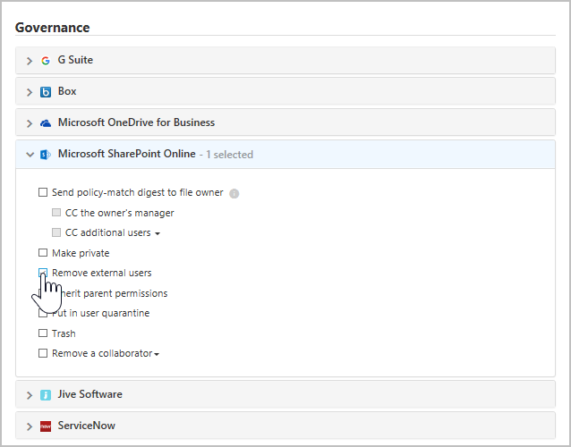

# 控制和保護您的檔案  

在現今的企業世界中，資料數量龐大且裝置數量眾多，因此，很難持續追蹤資料所在之處以及有權存取的人員。 Cloud App Security 可讓您能夠在雲端中啟用檔案保護來掌控您的資料。 Cloud App Security 提供工具，讓您能夠用來建立您想要在公司雲端中允許和不允許的原則，並給予廣泛的自動化程序，以提供持續的合規性掃描、合法的 eDiscovery 工作、適用於儲存於雲端或者外部或公開共用之機密內容的 DLP，以及更多使用者案例。  
Cloud App Security 可以根據 20 個以上的中繼資料篩選條件 (例如：存取層級、檔案類型) 來監視任何檔案類型。 如需詳細資訊，請參閱[檔案](file-filters.md)。 以下提供兩個所有組織都會面臨的資料相關威脅範例，以及如何在雲端中保護檔案的程序。
 
## 包含外部共用之機密資料的檔案 

這個使用案例適用於 Office 365、G Suite、Box、Dropbox 和 Salesforce。

### 威脅
雲端技術提供的最大優點之一是能夠與任何人共用任何項目。 但是能力愈大責任愈多，為確保不與外部共用機密資料，您需要知道哪些檔案包含機密資料，這些資料與哪些人共用。 使用雲端應用程式提供的工具，您無法分辨雲端應用程式儲存了什麼，或者誰存取了什麼，這讓您無法得知可能洩漏的資料。

### 解決方案
透過尋找這兩個參數：敏感度和共用層級，並且交叉使用，您就可以找出這些可能的缺口。 Cloud App Security 會掃描所有儲存在您雲端應用程式的檔案，並自動依其共用層級分類。 然後，您可以在 Cloud App Security 設定檔案原則，搜尋所有儲存在您雲端應用程式中的機密資料。 一旦發現與外部共用的機密檔案，您可以手動採取補救動作，或設定 Cloud App Security 為您自動執行補救動作。 如此一來，您只要按一下就可移除資料洩漏的風險。

#### 必要條件

將至少一個雲端應用程式[連接](enable-instant-visibility-protection-and-governance-actions-for-your-apps.md)到 Cloud App Security。

#### 設定監視

1.  透過設定掃描所有外部共用檔案是否有機密內容的原則，開始監視您的應用程式︰

    1. 在 [原則] 頁面上，按一下 [[建立檔案原則](data-protection-policies.md)]。 
    

    2. 在 [[原則範本](policy-template-reference.md)] 欄位中，選擇 [雲端中偵測到包含 PII 的檔案 (內建 DLP 引擎)]，然後按一下 [套用範本]。 
    
    3. 若要監視這些包含個人資訊之檔案的不當共用，請新增含有您嘗試防止之存取層級的篩選 - 例如，**存取層級等於外部、公用、公用 (網際網路)**。 
     

2. 調查相符項目
    
    1. 在 [原則] 頁面上，按一下原則名稱以移至 [原則報告]，然後檢閱原則所觸發的相符項目。

    2. 您可以按一下特定相符項目來開啟隱藏式檔案選單，藉以調查相符項目。 在隱藏式選單中，您可以看到此檔案相符的其他原則、內容掃描狀態，而且如果您按一下您可看到內容相符項目的選項，則您可以按一下 [共同作業者] 來查看共同作業者清單，並可查看檔案上是否有任何分類標籤。 您也可以看一下 [路徑]，以查看儲存檔案的位置，來取得有關檔案本身的更多內容。
    
    3. 如果您發現誤判，請為它們標上勾號，以便從報告和即時比對中排除它們。 您可以使用意見反應功能，讓 Cloud App Security 小組了解您想要新增的增強功能。 

#### 驗證您的原則

1. 建立新的 Word 文件，並在其中加上下列文字︰078-05-1120。
2. 然後，將檔案儲存為 test file.docx，並與您網域外部的人員共用，或透過公開 URL 來共用。 
3. 移至原則報告。 檔案原則相符項目應該很快就會出現。 
4. 您可以按一下相符項目以查看檔案的內容。 相符項目本身會加上遮罩以保護機密資料。 

#### 移除風險

在您驗證及微調原則之後，移除可能符合原則的可能誤報。 然後執行下列動作： 
  1. 您可以立即採取[治理動作](governance-actions.md)，方法是按一下資料列結尾的三個點，然後選取相關的治理動作，例如**將使用者置入隔離中**。

 

   2. 進行完整驗證之後，您可以設定它來執行自動治理動作。 例如，在 SharePoint 和 OneDrive 中，您可以**移除外部使用者**或**置入使用者隔離中**，而針對 G Suite 和 Box，您可以**移除外部使用者**和**移除公用存取權**。

  

## 公開共用檔案並標示為機密

這個使用案例適用於 Office 365、G Suite、Box、Dropbox 和 Salesforce。

這個使用案例會利用 Cloud App Security 與 Azure 資訊保護之間的整合。 如果您在整個組織中執行 Azure 資訊保護，並已花時間將檔案標上 Azure 資訊保護標籤，則 Cloud App Security 讓您能夠在為那些檔案標上標籤之後，監視並控制它們會發生什麼情況。

### 威脅

您知道您需要保護資料，您已經在 Azure 資訊保護中分類檔案時遇到問題。 但當您將它們分類之後，您如何得知它們的所在之處及誰能查看它們？ 

### 解決方案
 當這些分類的檔案位於雲端時，您可以使用 Cloud App Security 來監視它們。 這可讓您確認，分類為**機密** (或其他機密分類) 的資料不會被不當共用。 推出下列原則和控管動作，讓 Cloud App Security 監視和管理以 Azure 資訊保護分類的檔案。

#### 必要條件

- 將至少一個雲端應用程式[連接](enable-instant-visibility-protection-and-governance-actions-for-your-apps.md)到 Cloud App Security。
- 依照 [Azure 資訊保護整合指示](azip-integration.md)來啟用自動掃描。

#### 設定監視

1. 監視所有具有所需分類標籤的公開共用檔案︰    
    
    1. 在 [原則] 頁面上，按一下 [[建立檔案原則](data-protection-policies.md)]。 

    2.  在 [篩選] 區段中，您可以移除用於 [存取層級] 和 [上次修改] 的篩選，在您雲端中的所有檔案上執行此原則。 這些篩選僅適用於從現在起修改的檔案。 新增篩選 [分類標籤]，然後選取 [等於]，接著選取組織的分類標籤。 
    
    

    3.  若要監視這些已分類檔案的不當共用，請新增含有您嘗試防止之存取層級的篩選 - 例如，**存取層級等於公用、公用 (網際網路)**。  啟動原則之後，需要針對 Cloud App Security 花些時間來掃描現有的檔案，還有您新增的任何新檔案。 根據您在雲端中擁有的資料量而定，可能需要花費一些時間才能完成掃描。

    

2. 調查相符項目

    1. 按一下原則名稱以移至 [原則報告]，然後檢閱原則所觸發的相符項目。
    
    2. 您可以按一下特定相符項目來開啟隱藏式檔案選單，藉以調查相符項目。 在隱藏式選單中，您可以看到設定於此檔案中的分類標籤、此檔案相符的其他原則，而且您可以按一下 [共同作業者] 來查看共同作業者清單。 您也可以看一下 [路徑]，以查看儲存檔案的位置，來取得有關檔案本身的更多內容。
      
    3. 如果您發現誤判，請為它們標上勾號，以便從報告和即時比對中排除它們。 您可以使用意見反應功能，讓 Cloud App Security 小組了解您想要新增的增強功能。 

#### 驗證您的原則

1. 建立新的 Word 文件，並使用 Azure 資訊保護工具列來設定任何區分大小寫的標籤，例如**機密**。 

2. 將檔案上傳至您的雲端應用程式，然後透過公用 URL 加以共用。 

3. 移至**原則報告**。 檔案原則相符項目應該很快就會出現。 

4. 您可以藉由按一下檔案，然後開啟 [隱藏式檔案選單]，來查看分類標籤。 

#### 移除風險

在您驗證及微調原則，移除可能符合原則的可能誤報之後，請執行下列動作： 

1. 您可以立即採取[治理動作](governance-actions.md)，方法是按一下資料列結尾的三個點，然後選取相關的治理動作，例如**置入使用者隔離中**。
    
2. 進行完整驗證之後，您可以設定它來執行自動治理動作。 例如，在 SharePoint 和 OneDrive 中，您可以**置入使用者隔離中**，而針對 G Suite 和 Box，您可以**移除公用存取權**。
 
 

如需 Cloud App Security 與 Azure 資訊保護搭配使用的詳細資訊，請參閱[保護資料不受使用者錯誤影響](https://docs.microsoft.com/enterprise-mobility-security/solutions/protect-data-user-mistake)。

## 另請參閱  
[可保護雲端環境的日常活動](daily-activities-to-protect-your-cloud-environment.md)   
[如需技術支援，請前往 Cloud App Security 的輔助支援頁面。](http://support.microsoft.com/oas/default.aspx?prid=16031)   
[Premier 客戶也可以直接從 Premier 支援入口網站選擇 Cloud App Security。](https://premier.microsoft.com/)  
  
  